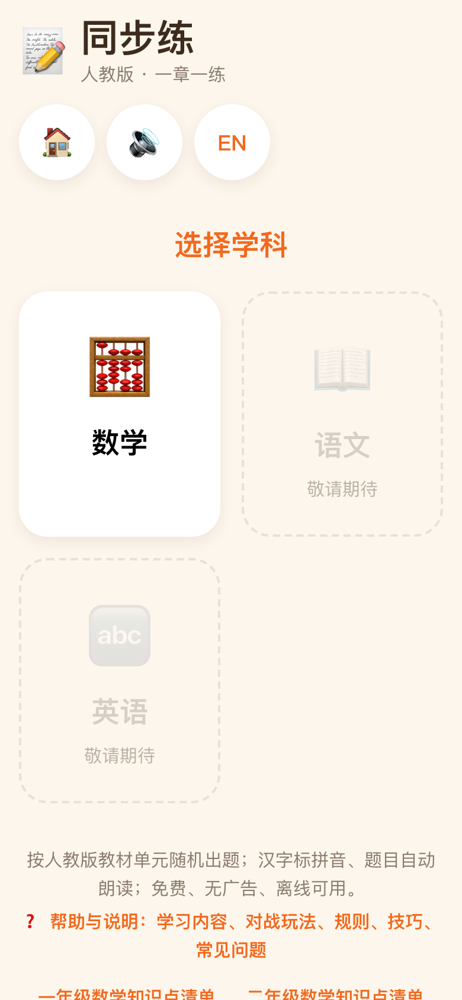
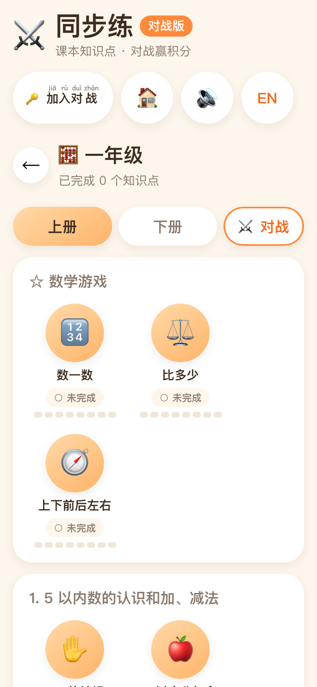
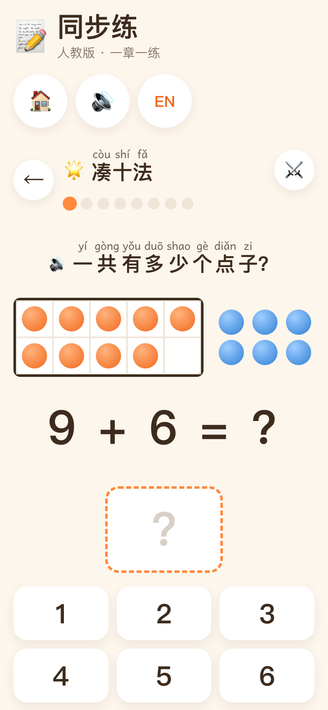
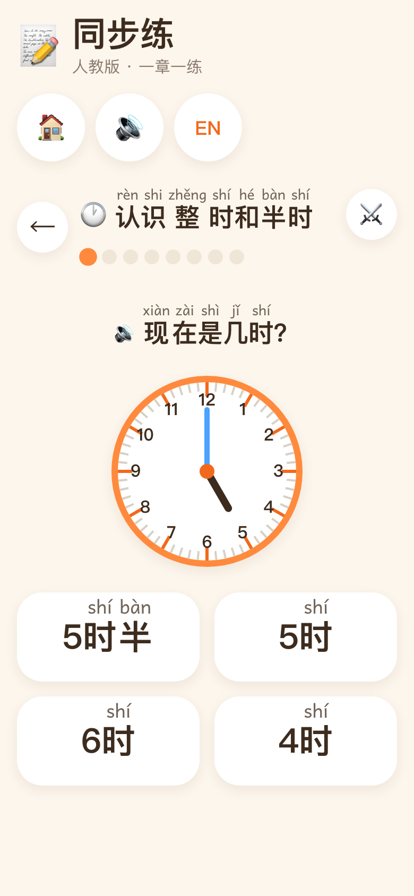
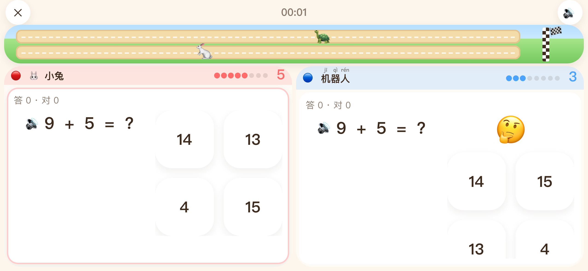

# 同步练

给小学生做的**人教版同步练习**：一到六年级，语文 / 数学 / 英语，按**现行最新版人教版教材**（2022 版课标教材）的章节（单元 → 知识点）出题、练习、打勾。

题目由程序按知识点**随机生成**（不是题库），每次练习 8 题，题干配十格阵、钟面、人民币、图形、数轴等可视化教具；答错当场用教具演示讲解（凑十法 / 破十法有动画）。**每个汉字都标拼音，每道题自动朗读**（离线预合成的语音，不依赖浏览器 TTS），识字不多的孩子也能自己练。还有**对战模式**：同一个知识点的题，两边比谁先答对 8 题——打机器人，或者两个人一台 iPad 左右分屏；每答对一题游戏画面就走一步（赛跑、火箭升空、盖楼、拔河、融冰）。纯前端、无后端、不联网、不要账号，进度只存在本机浏览器里；`dist/index.html` 可以直接双击离线打开。界面中文 / 英文一键切换（题目、拼音、朗读都跟着切）。

在线：**[tongbulian.jiaci.app](https://tongbulian.jiaci.app)**（手机 / iPad 打开后添加到主屏幕，离线可用）

**目前内容**：一年级数学（上册 6 单元 14 个知识点、下册 7 单元 12 个知识点）和二年级数学（上册 6 单元 15 个知识点、下册 5 单元 14 个知识点）全部可练，单元结构与 2024–2026 年新版教材一致（含「数学游戏」和带 ☆ 的综合与实践）；其它年级和语文、英语在目录里占位「敬请期待」，逐步补。

<p align="center">
  
  
  
  
</p>
<p align="center">
  
</p>

```bash
npm install
npm run dev          # http://localhost:5173
npm run build        # vue-tsc --noEmit && vite build → dist/
npm run preview
npm run typecheck    # vue-tsc --noEmit
npm test             # vitest run（生成器多种子自洽、题目渲染冒烟、整站集成、存储）
npm run test:watch
npm run screenshots  # npm run dev 之后：无头 Chrome 模拟 iPhone 截 README 用的预览图到 screenshots/（含横屏的对战竞技场）
npx vitest run src/content/math/grade2/generators/__tests__/generators.test.ts   # 单个文件
npx vitest run -t "凑十"                                                          # 按用例名过滤
npm run audio        # 重建朗读音频包（改了题目文案 / 生成器之后；需要 pip install edge-tts numpy 并联网）
npm run seo          # 按目录重新生成搜索引擎用的静态页与 index.html 里的简介（build / dev 前会自动跑）
npm run og           # 用无头 Chrome 重新渲染分享图 public/og.png（加了年级 / 学科之后）
```

## 孩子怎么用

1. 选学科 → 选年级 → 进入**知识点地图**（上册 / 下册两个页签，每个单元一张卡，知识点是圆形节点）。
2. 点一个知识点开始练习：一轮 8 题，进题自动读题干，题干下方的 🔊 可以再听一遍；用**数字键盘**或**四选一卡片**作答；答对撒花、夸一句，答错读出并显示正确答案（有教具的知识点会演示一遍），点「我知道了」继续。
3. 做完一轮就算「已完成」，地图上打勾。没做完的节点下面有 8 格进度条和这一轮的「x 题 · 对 y · 错 z」，中途退出下次接着做；做完的显示那一轮的对错数，再进去就开新的一轮重新计。家长也可以在地图上直接点状态标签手动标记 / 取消，不用做题。

4. 想比一比：地图右上角打开「⚔️ 对战」再点知识点（或练习页页头的 ⚔️），选跟谁打、选游戏，开始。

没有解锁、没有星星、没有排行，想练哪个点哪个。顶部栏的 🔊 / 🔇 可以关掉声音。

## 对战模式

同一个知识点的题，🔴 红队和 🔵 蓝队各答各的，**谁先答对 8 题谁赢**；答错不扣分、不锁题，1 秒多显示正确答案就出下一题。得分不只是数字：每答对一题，队区闪一下队色、飘一个「+1」、比分弹一下、队名下的 8 颗进度点亮一颗，游戏画面同时发生一次看得见的变化。连对 2 题起有 🔥 ×n，「叮」的音高越来越高；连对 3 / 5 题弹「连对 n 题！」、从落后变领先弹「反超啦！」、到 7 分弹「还差一分！」（都朗读）；到 8 分全屏撒队色彩纸、小号声加欢呼。现在有五种「皮肤」，每种都是一个有背景、有一直在动的小装饰、有待机 / 得分 / 冲刺 / 胜利动作的小场景，选游戏时可以挑，也可以「🎲 随机」：

| 皮肤 | 位置 | 场景 | 得 1 分 | 到 8 分 |
|---|---|---|---|---|
| 🐢🐇 赛跑 | 上方横条 | 天空、太阳、飘云、草地跑道、格子终点线和观众 | 自己的动物向终点跑一格、扬起尘土；到 6 分终点旗挥得更快 | 冲线，观众跳起来 |
| 🚀 火箭升空 | 左右之间 | 星空、闪的星星、行星，火箭平时悬浮喷小火 | 升高一段、喷大火；到 6 分目标星星脉动 | 到达星星，放烟花 |
| 🧱 盖楼 | 左右之间 | 天上有云和飞鸟，地上有草 | 一块带窗户的砖从天上掉下来弹一下 | 封顶插旗、放烟花 |
| 🪢 拔河 | 上方横条 | 草地、太阳、地上的中线、两头的水坑，两队各两只动物 | 绳子上的 🎀 向自己这边移一格（位置 = 比分差，翻盘感强），两队后仰用力；到 6 分绳子发抖 | 对方被拉过线、掉进水坑 |
| 🧊 融冰 | 左右之间 | 飘雪，底下是水面有鱼游 | 对方的 8 块冰先裂再化成水滴 | 对方冰全化，企鹅滑进水里溅水花 |

手机横屏的矮横条 / 窄竖条会用 CSS 容器查询自动隐藏装饰，只留角色与轨道。

- **跟谁打**：「🤖 打机器人」——机器人有自己的题，按 🐢 慢 / 🐰 中 / 🚀 快三档节奏答题，会一个一个按出数字、也会答错，还有表情（🤔 想题、🤖 在按、😄 答对、😅 答错）；「👫 两人一台」——一台 iPad / 电脑横着放，左右各一个人的题和键盘，可以同时按。「📱 各用各的」（每人一台设备、经房间链接同步，可观战）在做，敬请期待。
- **竞技场一律横向**：左区红队、右区蓝队、游戏画面在上方横条或左右之间的竖条（皮肤说了算）。手机竖着拿会提示「请把手机横过来」，横屏用紧凑版布局（题干与键盘左右并排）；iPad / Android / 电脑进竞技场会试着全屏。
- **名字**：第一次进对战问一次「你叫什么？」，可以点现成的（🐰 小兔、🐯 小虎……），以后不再问；两人同屏时左右各记一个。名字只显示、不朗读，播报用「红队 / 蓝队」。
- **声音**：打机器人时进题自动读题（两人同屏不自动读，点 🔊 读自己的题，互相打断）；答对「叮」（连对时越来越高）+ 按皮肤一声（呼啸 / 咚 / 咔嚓）、答错「咚」、倒数「嘀嘀嘀 — 嘟」、弹出提示「啵」、胜利小号声加欢呼，都是 WebAudio 振荡器和噪声现场合成的，没有音频文件。
- **结果页**：🏆 谁赢、比分、用时、每人「答 n · 对 m」，输的一方写「差一点点！」；「再来一局」（同样的人和游戏，换一组题）、「换个游戏」、「退出」。对战不改地图上的练习进度，也不存战绩。

## 拼音与朗读

- **拼音**：中文模式下练习页的所有汉字（题干、选项、页头、答错讲解、结算）都逐字注音，字体用为初学者设计的 [Andika](https://software.sil.org/andika/)（单层 a / g，OFL，自托管）。每条中文词条配一条与汉字逐字对齐的拼音（各内容包的 `pinyin.ts`、`src/locales/shell.ts`），一 / 不按实际读音标变调，有测试保证音节数与汉字数相等。
- **朗读**：不用浏览器 TTS 读汉字。题目文字按「数字 / 汉字短语 / emoji 的名字 / 运算符与括号的读法」切成片段（`src/engine/speech.ts`），每个片段是一条预先合成好的 mp3（`public/audio/`，Microsoft Edge 神经语音，来源见 `public/audio/CREDITS.md`），播放时顺序拼接：「9 + 5 = ?」读作「九 · 加 · 五 · 等于几」，「(3 + 4) × 5 = ?」读作「括号 · 三 · 加 · 四 · 括号 · 乘 · 五 · 等于几」，「🐰 从左数排第几个？」读作「小兔子 · 从左数排第几个」。100 以上的数按课本读法拆成几段（3005 → 三千 · 零 · 五），所以万以内的数不用每个都录一条。缺片段（比如刚加了新题型还没重跑脚本）才退回浏览器 TTS。
- **音频包**：`npm run audio` = `scripts/collect-speech.mjs`（跑遍所有生成器收集片段 → `src/audio/corpus.json`）+ `scripts/build-audio.py`（edge-tts 合成、裁静音、响度归一、转 24 kHz 48 kbps mp3 → `public/audio/` 与 `src/audio/manifest.json`）。有测试保证语料与代码一致、每个片段都有文件。
- iOS / Safari 要在用户手势里解锁音频：任何一次触摸都会顺手解锁，之后自动读题不再受限；直接用地址打开练习页时第一题会等到第一次触摸才有声音。

## 一年级数学知识点

| 上册 | 下册 |
|---|---|
| ☆ 数学游戏：数一数、比多少、上下前后左右 | 认识平面图形：平面图形 |
| 5 以内数的认识和加、减法：1~5 的认识、5 以内分与合、5 以内加减法 | 20 以内的退位减法：破十法 |
| 6~10 的认识和加、减法：6~10 的认识、6~10 的组成、10 以内加减法、连加连减加减混合 | 100 以内数的认识：100 以内的数、比大小、整十数加减法 |
| 认识立体图形：立体图形 | 100 以内的口算加、减法：口算加法、口算减法 |
| 11~20 的认识：11~20 的认识、简单加减法 | 100 以内的笔算加、减法：笔算加法、笔算减法（竖式） |
| 20 以内的进位加法：凑十法 | 数量间的加减关系：两数相差几、比一个数多几或少几 |
| | ☆ 欢乐购物街：认识人民币 |

## 二年级数学知识点

| 上册 | 下册 |
|---|---|
| 分类与整理 | ☆ 时间在哪里：认识整时和半时、认识几时几分、时与分 |
| 1~6 的表内乘法：乘法的初步认识、2~6 的乘法口诀、乘加乘减、用乘法解决问题 | 有余数的除法：认识余数、有余数除法的计算 |
| 1~6 的表内除法：平均分、认识除法算式、用 2~6 的乘法口诀求商、用除法解决问题 | 数量间的乘除关系：倍的认识、乘除法解决问题 |
| ☆ 校园小导游：认识东、南、西、北 | 万以内数的认识：1000 以内、10000 以内、大小比较、整百整千数加减法 |
| 厘米和米：认识厘米和米、量一量 | 万以内的加法和减法：三位数加法、三位数减法（竖式）、加减法各部分间的关系 |
| 7~9 的表内乘、除法：7、8、9 的乘法口诀、用 7、8、9 的乘法口诀求商、连续两问 | |

每个知识点内部分三档难度，一轮里按约 60% 当前档、25% 低一档、15% 高一档混合出题（当前档暂固定为第 1 档）。

## 部署与装到 iPad

纯静态站：`npm run build` 后把 `dist/` 整个放到任何支持 HTTPS 的静态托管（nginx、对象存储、Pages 服务都行），不需要服务端；`base: './'`，放在子目录也能跑。

- **搜索引擎**：应用是 hash 路由，搜索引擎只看得到根地址，所以构建前 `scripts/seo.mjs`（`prebuild` / `predev` 自动跑，也可 `npm run seo`）按目录生成一套不用 JS 的静态页放进 `public/`：每个上线课程一张目录页（`math/g1/`：上下册单元与知识点清单）、每个知识点一张（`math/g1/s1-05-carry-add.html`：介绍、固定种子生成的 6 道示例题含选项与答案、同单元其它知识点、「开始练习」深链到应用），都带标题 / 描述 / canonical / Open Graph / 面包屑 JSON-LD。入口页 `index.html` 的标题、描述、JSON-LD 与应用挂载前的静态简介也由同一份目录生成（写在 `<!-- seo:head -->` / `<!-- seo:body -->` 两段标记之间，别手改，有测试保证与目录一致），首页底部有各清单页的链接，子页的 `<title>` 跟随页面。页面文案在 `src/seo/site.ts`。
- 构建时若本机 `.env` 里有 `SITE_URL=https://你的域名`，页面会带上 canonical / Open Graph 的绝对地址，并生成 `robots.txt` 与列出全部静态页的 `sitemap.xml`；没有就不带（页面照常可用，也没有 sitemap）。分享图 `public/og.png`（1200×630）由 `npm run og` 用无头 Chrome 渲染，文案取自同一份目录。静态页与分享图不进离线包；托管时最好让未命中的地址直接 404（不要回退到 `index.html`，会被搜索引擎当成软 404）。
- 已注册 Service Worker（vite-plugin-pwa，`registerType: 'autoUpdate'`）：首次打开会把页面、字体和全部朗读片段（约 5.7 MB）预缓存，之后断网可用；重新部署后再打开会自动换新版本。自己部署时**必须是 HTTPS**（局域网 http 地址不行，Service Worker 不会注册）。
- **安装提示**：没从主屏幕打开时，首页顶上有一条「安装 同步练」提示（给家长看的，不出声、不遮按钮）：Android / 电脑 Chrome、Edge 点「安装」直接弹系统安装框；iPhone / iPad 点「怎么做」看步骤（Safari 分享 → 添加到主屏幕）；微信 / QQ 里教先在浏览器打开。关掉 3 天后再提示，装好了不再出现；电脑上只在能一键安装时提示。逻辑在 `src/engine/install.ts`（可单测）+ `src/stores/install.ts`，画在 `components/ui/InstallBar.vue`，静默期记在 localStorage `tongbulian:install`。

## 技术栈

Vite + Vue 3（Composition API）+ TypeScript + Pinia + Vue Router（hash 路由，`base: './'`），原生 CSS + design tokens，不用 UI 框架，vite-plugin-pwa 做离线缓存；测试用 Vitest（生成器测试跑在 node，组件测试用 happy-dom）。音频包由 Python 脚本生成（edge-tts + numpy + ffmpeg），运行时不需要。

## 架构

按「**引擎** / **内容包** / **界面**」三层分开，加学科、加年级只动内容包和目录各一处。

```
src/
├── engine/                  引擎：与学科 / 年级无关
│   ├── session.ts           生成器注册表 defineGenerator + 组卷 buildSession（按题目签名去重、三档难度混合）
│   ├── question.ts          出题骨架：numberQuestion / labelQuestion / choicesFrom / numberDistractors（各内容包共用）
│   ├── rng.ts               可注种子的随机数（测试可复现）
│   ├── catalog.ts           目录：SUBJECTS（学科 → 年级，live / soon）+ 课程注册表 registerCourse
│   ├── i18n.ts              可本地化字符串 LStr 的运行时：registerDict / translate / t / ui / 当前语言；
│   │                        registerPinyin / rubySegments 把 LStr 解析成逐字注音的片段
│   ├── answer.ts            判题与正确答案文本
│   ├── speech.ts            朗读文本：把题干 / 答案切成片段（数字、短语、emoji 名、运算符 / 括号读法；大数按位拆读）
│   ├── voice.ts             朗读序列：片段 → manifest 里的音频文件，say / hush / warmUp、静音开关
│   ├── audio.ts             播放引擎：AudioContext 解码缓存、首次触摸解锁、file:// 退化为 <audio>
│   ├── tts.ts               浏览器 TTS，只做缺文件时的兜底
│   ├── runner.ts            独占任务：同一时刻只跑一条声音序列，新的会打断旧的
│   ├── storage.ts           localStorage 单一根 key + 版本迁移
│   └── index.ts             入口只导出 session / rng（故意不含 catalog，避免循环依赖）
├── content/<学科>/<年级>/     内容包：一个「学科 × 年级」一个目录，自给自足（现有 math/grade1、math/grade2）
│   ├── curriculum.ts        单元树 + 知识点树（中文标题是单一事实源）
│   ├── generators/          每个知识点的题目生成器，defineGenerator 自注册
│   ├── i18n.ts              该包的题目 / 选项 / 教具文案（中英）+ 知识点、单元英文名
│   ├── pinyin.ts            每条中文词条的拼音（与汉字逐字对齐）
│   └── index.ts             导出 Course；被 catalog import 即完成全部注册
├── content/math/shared/     数学各年级共用：图形名与拼音、金额 / 时刻格式化、符号读法、emoji 名字、答错讲解的教具参数
├── battle/                  对战：protocol.ts 一局的快照与事件；match.ts 比赛状态机（纯函数：加分、判胜、连对 / 反超 / 还差一分事件）；stream.ts 题目流
│   │                        questionAt(kpId, seed, 难度, 序号)（分批 buildSession，任何设备都能复现别人的题）；ai.ts 机器人的节奏与答案；
│   │                        names.ts 现成名字池；sfx.ts WebAudio 合成的音效；skins/ 皮肤注册表 + 每种皮肤一个组件（只看比分）
├── audio/                   朗读语料：corpus.ts 收集片段、corpus.json / manifest.json（脚本生成）
├── seo/site.ts              搜索引擎用的静态页（课程目录页、知识点页含示例题）、robots / sitemap、index.html 两段简介的生成
├── locales/shell.ts         应用外壳词条（品牌、目录、导航、结算、鼓励语、安装提示）及其拼音，中英
├── components/
│   ├── ui/                  通用控件：顶部栏、页头、大按钮、数字键盘、选择卡、撒花、注音文字 RubyText、安装提示条 InstallBar
│   ├── practice/            练习流程：题干渲染 QuestionRenderer、作答面板、结算页
│   ├── battle/              对战：队区 TeamPanel（进度点、+1、闪光）、成员行 PlayerRow（可操作 / 观看两种，🔥 连对）、作答显示 WatchInput（机器人表情）、
│   │                        弹出提示 Callout、胜利彩纸 VictoryOverlay、倒数、结果页、横屏提示、昵称面板、选皮肤
│   └── math/                数学教具：十格阵、钟面（含分钟刻度）、人民币、图形、数轴、序列、排队、尺子、角、竖式…
├── views/                   选学科 → 选年级 → 知识点地图 → 练习；battle/ 对战设置页与竞技场
├── stores/                  progress（按知识点记已完成、当前这一轮的 seed 与对错数）、settings（语言 / 声音）、install（安装提示：事件、静默期）、
│                            battle（昵称等偏好 `tongbulian:battle`、当前这一局、答完的反馈窗口、机器人计时器）
├── styles/                  tokens.css（结构令牌 + 基础调色板 + 拼音字体）、themes.css（按学科换肤）、base.css
└── types/models.ts          全部核心类型：Question / StemPart / Course / KnowledgePoint …
public/audio/                朗读音频片段（脚本生成）；public/fonts/ 拼音字体 Andika；图标；og.png 分享图
public/<学科>/<年级>/         搜索引擎用的静态页（scripts/seo.mjs 构建前生成，连同 robots.txt / sitemap.xml 都不进仓库）
screenshots/                 README 用的预览图（npm run screenshots 生成，不进构建产物）
scripts/                     collect-speech.mjs 收集语料、build-audio.py 生成音频包、seo.mjs 生成静态页、og.mjs 渲染分享图
vite.config.ts               base './'、PWA 清单与预缓存（静态页不进离线包）、siteMeta（按 .env 的 SITE_URL 填 canonical 等绝对地址）
```

数据层级：学科 → 年级 → 课程（内容包）→ 上册 / 下册 → 单元 → 知识点 → 生成器。路由 `/s/:subjectId/g/:gradeId/practice/:kpId`；对战只带知识点：`/battle/new/:kpId`（设置）、`/battle/local/:kpId?mode=ai|duo`（单设备竞技场）。

### 几条不变量

- **作答只落到 numpad / choice**：题干可以用任意 `StemPart` 可视化，答案必须是数值或选项 id，这样每个生成器都能单测（多种子跑结构自洽、答案正确、干扰项合法、签名去重）。
- **生成器产出 `LStr`**（字面量或 `{ k, p }` 词条键），渲染期按当前语言 `translate`，切语言即时重排；界面文案走 `ui(key)`。孩子会看到的中文词条都要在 `pinyin.ts` 配拼音（测试会查），朗读片段从渲染后的文字里切出来，改了文案要重跑 `npm run audio`（测试会查语料是否过期）。
- **知识点 id 全局唯一**（生成器注册表是全局 Map），新年级用不同前缀。
- **引擎不认识内容**：`@/engine` 不导出 catalog，目录相关从 `@/engine/catalog` 导入；内容包只依赖 `@/engine` 与 `@/types`。
- **皮肤靠 `<html data-theme>`**：`App.vue` 按当前学科切换，颜色全走 CSS 变量。
- **对战与内容解耦**：游戏皮肤只吃 `{ red, blue, target, phase, winner, lastPoint }`，不认识题目；题目流由 `(kpId, seed, 难度, 序号)` 确定，所以对手 / 观战 / 重连都能复现同一道题，服务器（以后的多设备模式）不用传题；比赛状态机是纯函数，单设备在页面里跑，多设备时同一份跑在中继服务上。新皮肤 = `battle/skins/` 加一个组件 + 注册表一行（有测试把每种皮肤在 0…8 × 0…8 的每个比分下渲染一遍）。

### 加一个年级（例：三年级数学）

1. 按当年人民教育出版社的电子教材目录（不是旧版）新建 `src/content/math/grade3/`，照 `grade2` 建 `curriculum.ts` / `generators/` / `i18n.ts` / `pinyin.ts` / `index.ts`，知识点 id 用新前缀（二年级是 `m2s<册>-<目录位置两位>-<语义名>`，三年级就用 `m3s…`），词条键也按主题起名别与已有内容包重名（`shape.*` / `sym.*` / `emoji.*` 从 `content/math/shared/` 取）；教材里带 ☆ 的综合与实践单元置 `numbered: false`。
2. `src/engine/catalog.ts`：`import` + `registerCourse(mathGrade3)`，并把 math 学科里 `grade('g3')` 改成 `grade('g3', 'math-g3')`。
3. 照 `grade2/generators/__tests__/generators.test.ts` 与 `grade2/__tests__/pinyin.test.ts` 建测试，`render.test.ts` / `speech.test.ts` 的知识点列表加上新包。
4. `npm run audio` 生成新增片段的音频；`npm run seo` 更新 `index.html` 的简介（测试会查）、`npm run og` 重画分享图。
5. 完。选择页、地图、练习、主题、拼音、朗读、静态页与 sitemap 自动生效。

### 加一个学科（例：语文一年级）

1. 新建 `src/content/chinese/grade1/`（同上四件套）。有新题型就在 `types/models.ts` 扩 `QuestionType` / `StemPart`，在 `components/<学科>/` 加教具，在 `QuestionRenderer` 加一个分支；作答仍收敛到 numpad / choice。
2. `catalog.ts` 里 `registerCourse`，把该学科 `status: 'soon'` 改 `'live'`、对应年级挂 courseId。
3. `styles/themes.css` 已给 `[data-theme="chinese"]` / `english` 各一套配色，按需微调。
4. `npm run audio` 生成新增片段的音频；`npm run seo`、`npm run og` 同上。

## 同一作者的其它学习应用

- [AI加词](https://jiaci.app)：背单词，FSRS 间隔重复、AI 填充的词条资料、真人级发音。
- [拼音学习机](https://pinyin.jiaci.app)：给学拼音的孩子的点读 / 拼读 / 跟读 / 测验键盘，真人录音。
- [识字卡片](https://kapian.jiaci.app)：2–4 岁看图听音认知卡片，中英文、离线。

首页底部和每张知识点静态页的页脚都有这三个链接。

## 许可

MIT，见 [LICENSE](LICENSE)。朗读音频由 Microsoft Edge 神经语音合成，仅供学习使用（`public/audio/CREDITS.md`）；拼音字体 Andika 为 SIL Open Font License（`public/fonts/OFL.txt`）。
