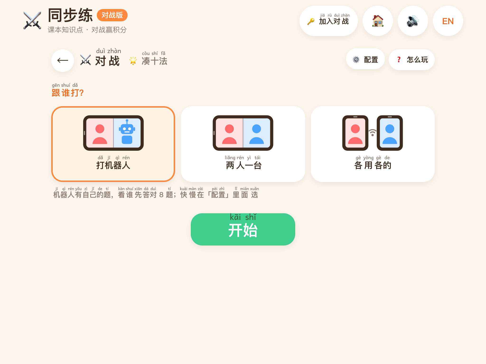
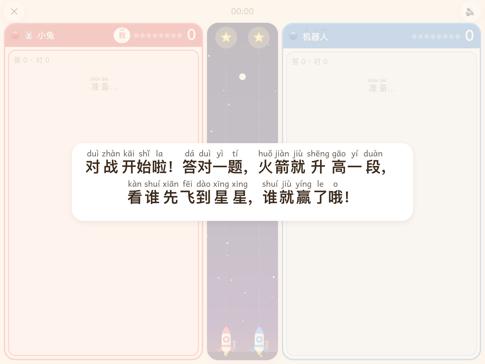
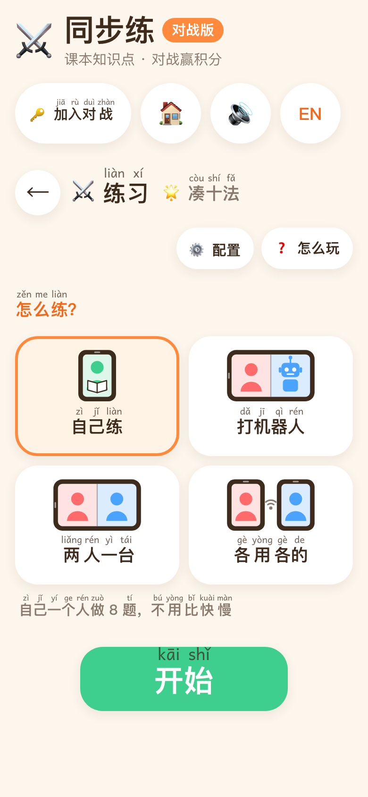
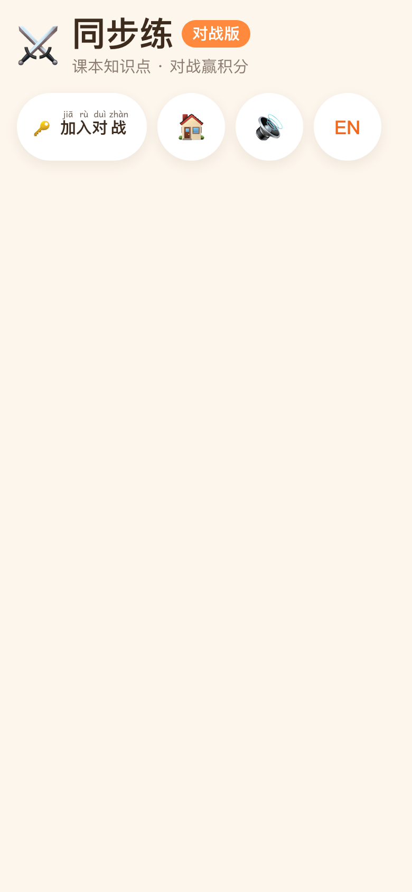

# 同步练-对战版

**儿童互动对战学习**：把**人教版官方课本的知识点测验**变成游戏积分——答对一题，小乌龟就往前跑一格、火箭升高一段、楼再盖一层……谁先答对 8 题谁赢。题目按**现行最新版人教版教材**（2022 版课标教材）的单元 → 知识点随机生成，一到六年级 × 语文 / 数学 / 英语；练的是课本，玩的是游戏，寓教于乐。可以打机器人、两人一台 iPad 同屏，或者每人一台设备扫码进同一个房间；不想比的时候，它就是一份安静的同步练习。

在线：**[tongbulian.jiaci.app](https://tongbulian.jiaci.app)**（手机 / iPad 打开后添加到主屏幕，离线可用）

- **课本知识点 = 游戏积分**：对战和练习用的是同一套按教材出的题，每答对一题得 1 分，比分直接驱动游戏画面（赛跑、赛车、火箭升空、热气球、游泳、爬梯子、挖宝、盖楼、拔河、融冰，十种 canvas 实时绘制的小场景），连对 / 反超 / 冲刺有提示和音效，赢了撒彩纸。孩子以为在玩游戏，其实每一分都是一道课本题。
- **三种对战方式**：打机器人（三档快慢，会一个一个按数字、也会答错）；两人一台 iPad 左右同屏；每人一台设备扫码进同一个房间——红队 / 蓝队 / 观战，每队最多 6 人，两队齐了自动开始，结果页「下一章」接着打本册下一个知识点。
- **也能安静地练**：一轮 8 题，做完打勾。随机出题，不是题库：每个知识点一个生成器，题干配十格阵、实物图、钟面、人民币、图形、数轴、尺子、竖式、排队等可视化教具；答错当场用教具演示讲解（凑十法 / 破十法有动画）。
- **识字不多也能自己玩**：每个汉字标拼音，每道题自动朗读（离线预合成的语音片段拼播，不依赖浏览器 TTS）；对战里让孩子照着做的提示（跟谁打、你叫什么、扫码进入、等大家进来、输口令……）在出现的那一刻也会读出来。
- **没有惩罚**：练习不计时、不扣分、没有排行、没有解锁链；对战答错不扣分、不锁题，输了只写「差一点点！」，也不改练习进度、不存战绩。
- **纯前端、离线、不要账号**：进度只存在本机浏览器里，`dist/index.html` 可以直接双击打开；只有对战的多设备模式需要一个小小的内存中继服务（仓库 `server/`）。
- **开源、干净**：代码全部以 MIT 许可公开在这个仓库里，谁都能查、也能自己部署一套；免费、无广告、不用注册、不收集个人信息。首页底部和每张静态页页脚都写着这一句并链到仓库；「分享给朋友」一键调系统分享面板（微信里教用右上角菜单，电脑上复制一段话），对战结果页还能「分享战绩」。
- 界面中文 / 英文一键切换，题目、拼音、朗读都跟着切。

**目前内容**：一年级数学 26 个知识点、二年级数学 29 个知识点全部可练可对战，单元结构与 2024–2026 年新版教材一致（含「数学游戏」和带 ☆ 的综合与实践，清单见[知识点清单](#知识点清单)）；其它年级和语文、英语在目录里占位「敬请期待」，逐步补。

<p align="center">
  
</p>
<p align="center">
  
</p>
<p align="center">
  
</p>
<p align="center">
  
  
  
  
</p>
<p align="center">
  
  
</p>

## 快速开始

```bash
npm install
npm run dev          # http://localhost:5173（启动前自动生成搜索引擎用的静态页）
npm run build        # vue-tsc --noEmit && vite build → dist/
npm run preview
npm run typecheck    # vue-tsc --noEmit
npm test             # vitest run：生成器多种子自洽、拼音对齐、语料一致、题目渲染、整站集成、对战状态机与中继服务
npm run test:watch
npx vitest run src/content/math/grade2/generators/__tests__/generators.test.ts   # 单个文件
npx vitest run -t "凑十"                                                          # 按用例名过滤
```

素材与核对工具（改了对应的东西才需要跑）：

```bash
npm run audio          # 重建朗读音频包（改了题目文案 / 生成器 / 外壳固定句之后；需要 pip install edge-tts numpy 并联网）
npm run seo            # 按目录重新生成搜索引擎用的静态页与 index.html 里的简介（build / dev 前会自动跑）
npm run og             # 用无头 Chrome 重新渲染分享图 public/og.png（加了年级 / 学科之后）
npm run screenshots    # npm run dev 之后：无头 Chrome 模拟 iPhone / iPad 截 README 用的预览图到 screenshots/
npm run battle:survey  # npm run dev 之后：每种「题干 × 作答方式」在 iPhone / iPad 横屏各截一张并拼图，肉眼核对对战排版；加 -- practice 查练习页
npm run game:survey    # npm run dev 之后：每种游戏在几个比分 / 倒数 / 胜利 / 手机紧凑版各截一帧并拼图
npm run build:server   # 打包对战中继服务 → dist-server/battle.mjs
npm run battle:dev     # 打包并在本机 127.0.0.1:8787 起中继服务（dev 服务器把 /ws 代理过去）
```

## 孩子怎么用

首页顶部栏是「⚔️ 同步练」+「对战版」标记，标题下面一条每种游戏的图标和一句「答对课本题就得分，谁先答对 8 题谁赢！」（带拼音）；顶栏的「🔑 加入对战」输口令就能进别人建的房间。

1. 选学科 → 选年级 → 进入**知识点地图**（上册 / 下册两个页签，每个单元一张卡，知识点是圆形节点）。
2. 点一个知识点开始练习：一轮 8 题，进题自动读题干，🔊 可以再听一遍；用**数字键盘**或**四选一卡片**作答；答对撒花、夸一句，答错读出并显示正确答案（有教具的知识点会演示一遍），点「我知道了」继续。
3. 做完一轮就算「已完成」，地图上打勾。没做完的节点下面有 8 格进度条和这一轮的「x 题 · 对 y · 错 z」，中途退出下次接着做；做完的显示那一轮的对错数，再进去就开新的一轮重新计。家长也可以在地图上直接点状态标签手动标记 / 取消，不用做题。
4. 想比一比：地图右上角打开「⚔️ 对战」（关着也带橙色描边，一眼能找到）再点知识点（或练习页页头的 ⚔️），选跟谁打，开始。

没有解锁、没有星星、没有排行，不计时、不扣分，想练哪个点哪个；顶部栏的 🔊 / 🔇 可以关掉声音。每个知识点内部分三档难度，一轮里按约 60% 当前档、25% 低一档、15% 高一档混合出题（当前档暂固定为第 1 档，没有更低档，实际 85% / 15%）。

应用里有一页「❓ 帮助与说明」（首页底部、对战设置页页头的「怎么玩」都能进），分对战怎么玩、游戏规则、游戏技巧、学习内容与题目、常见问题五节，中英文随界面切换；在线版另有一张不用 JS 的静态页 [tongbulian.jiaci.app/help/](https://tongbulian.jiaci.app/help/)。

## 对战模式

对战的题和练习页是同一套生成器按教材知识点出的（同一个知识点、同样的难度档），只是把「答对」变成了「得分」：🔴 红队和 🔵 蓝队各答各的，**谁先答对 8 题谁赢**；答错不扣分、不锁题，1 秒多显示正确答案就出下一题。对战不改地图上的练习进度，也不存战绩。

### 跟谁打

设置页只有三张卡（各画一幅示意图，一眼看出模式）和「开始」；机器人快慢、选游戏、改名字都在页头「⚙️ 配置」里。

- **打机器人**：机器人有自己的题，按 🐢 慢 / 🐰 中 / 🚀 快三档节奏答题，会一个一个按出数字、也会答错，还有表情（🤔 想题、🤖 在按、😄 答对、😅 答错）。进题自动读题。
- **两人一台**：一台 iPad / 电脑横着放，左右各一个人的题和键盘，可以同时按。不自动读题，点 🔊 读自己的（互相打断）。
- **各用各的**：每人一台设备，进同一个房间（见下一节）。用 `file://` 打开或托管方没有中继服务时这张卡置灰。

**竞技场一律横向**：左区红队、右区蓝队，游戏画面在上方横条或左右之间的竖条（游戏说了算）；每人一行题目 + 键盘 / 选项卡。两队一眼分清：队区整块队色描边，队名条实心队色白字，题目里的按钮白底、队色描边、队色底边；自己那一队的队名条上标「我」，本机不能操作的行蒙一层半透明遮罩、右上角写「对方」或「队友」（两人一台两边都是自己，不标不蒙），只观战的设备顶栏写「👀 观战中」。手机竖着拿会提示横过来，横屏用紧凑版布局（题干与键盘左右并排，键盘按栏高缩放）；平板 / 手机进竞技场会试着全屏（电脑不会）。

**名字**：从来没输过名字的设备，第一次点「开始」才问一次「你叫什么？」（可以点现成的 🐰 小兔、🐯 小虎……），以后不再问；两人一台的右边第一次也问一次。名字只显示、不朗读，播报用「红队 / 蓝队」。

### 各用各的：多设备房间

1. 一个人在设置页选「各用各的」→「建房间」，屏幕上就是三个二维码：左边红队、右边蓝队、下面观战，每个带 6 位数字口令、链接和「复制链接」；建房的这台设备先只观战。
2. 红队的人扫红队码、蓝队的人扫蓝队码进来（不方便扫码就点顶栏的「🔑 加入对战」输那个身份的口令；没输过名字的设备先问一次名字），先看到「三方连接状态」窗口：红队、蓝队各有谁、观战几人，没到的一方写「等待连接…」。二维码页上每个码下面也写着谁已进入；一队有人后，建房的设备可以「以另一队进入」自己上场，或「以观战方进入」只看。
3. **红蓝两队都有人进来就自动开始**，不用谁点开始。每台设备上都是完整的竞技场，**只有自己那一行能操作**，别人的行实时显示他在答什么、按了什么、对还是错；队伍比分 = 队里所有人答对的题数之和（每队最多 6 人，人数不要求相等），用时按服务器时钟算。
4. 结果页三个角色一模一样：「下一章」在同一个房间接着打这一册的下一个知识点（游戏换成那一章的，不用重新建房、重新扫码，可以一直打到这一册最后一个）、「再来一局」、「不玩了」（关掉房间，大家一起回地图）；谁先点就按谁的，三台设备一起变。

题目在各自设备上生成与判分（同一个种子，服务器只记谁答到第几题、对了几题）；断线自动重连并接回原座位（页面回到前台立刻重连）；一台设备只算一个人（同一个浏览器再开一个标签页会顶掉先开的）；主持人（建房的设备）掉线 20 秒内回来不换人，超过才把主持权交给最早在线的人。房间只在服务器内存里（没人 10 分钟或建房 3 小时后销毁），不落库、不记内容日志；链接 `#/battle/<房间号>?t=red|blue|watch`，房间号本身就是密钥。页面版本比服务旧时自动更新重载再进，连不上时提示检查网络。

### 游戏画面

每答对一题：队区闪一下队色、飘一个「+1」、比分弹一下、队名下的 8 颗进度点亮一颗，游戏画面同时发生一次看得见的变化；连对 2 题起有 🔥 ×n，「叮」的音高越来越高；连对 3 / 5 题弹「连对 n 题！」、从落后变领先弹「反超啦！」、到 4 分「到一半啦！」、到 7 分「还差一分！」（都朗读）；到 8 分全屏撒队色彩纸、播报队名再接一句游戏话（「火箭飞到星星啦！」）。本设备第一次进某个游戏先讲一句规则（「对战开始啦！答对一题，火箭就升高一段，看谁先飞到星星，谁就赢了哦！」，同一个游戏一天内不重复，再来一局也不讲），说完再倒数。

现在有十种游戏，每种都是一个有背景、有一直在动的小装饰、有待机 / 得分 / 冲刺 / 胜负动作的小场景，全部用 canvas 实时绘制（矢量角色、粒子、缓动，没有图片）：

| 游戏 | 位置 | 场景 | 得 1 分（连对 / 被反超） | 冲刺（到 6 分起）与到 8 分 |
|---|---|---|---|---|
| 🐢🐇 赛跑 | 上方横条 | 天空、太阳、飘云、山丘与小树，两条草地跑道各 8 个蘑菇标记（跑过就亮），举旗的发令员小猴、格子终点柱 + 彩旗拱门 + 观众 | 自己的动物向终点跑一格、扬尘、拖速度线；连对加速；被反超的回头看 | 终点旗挥得更快、横幅发光；冲线喷彩纸、观众跳起来，胜方转圈 / 后空翻，负方缩壳 / 耷拉耳朵 |
| 🏎️ 赛车 | 上方横条 | 柏油路、红白路肩、车道虚线、黑白格子终点线，发令员和观众 | 队色赛车向前跑一格、辐条轮子按距离转、车身微颠冒尾气；连对喷氮气尾焰、车头微翘；被反超的司机回头看 | 还差一分终点旗猛挥；冲过格子线翘头蹦、撒彩纸，输的熄火一股一股冒黑烟 |
| 🚀 火箭升空 | 左右之间 | 星空里各按节奏闪的星星、带环的行星、月亮、隔几秒划过的流星，两列各有发射台、虚线导轨和顶上带光晕的目标星 | 升高一段、喷大火向下冒烟；连对火更大；被反超晃一下 | 目标星脉动；抵达时星星炸成光芒、放三轮队色烟花、火箭绕小圈，负方断火冒黑烟微微下沉 |
| 🎈 热气球 | 左右之间 | 从浅蓝到深蓝的天空、太阳、山丘、飘云，顶上一层厚云是目标，小鸟飞过 | 烧嘴爆燃冒火星、升高一段，篮子里的乘客挥手；连对烧得更旺；被反超的回头看 | 还差一分云层发光；飞到云上再往上飘、连撒三轮彩纸，输的火熄了、球囊瘪一点往下沉 |
| 🏊 游泳 | 上方横条 | 俯视的泳池：瓷砖甲板上有遮阳伞、救生圈、吹哨的发令员和观众，红上蓝下两条泳道、珠子分道线、池底 8 块地砖标记、队色出发台、池壁的黄色触板，水面亮纹慢慢漂 | 戴泳帽泳镜的青蛙 / 小鸭向前游一格：手臂轮流划水、脚下打出水花、头前推出白浪，地砖亮起；连对划得更急；被反超的回头看；倒数蹲在出发台上、开始跳水入池溅水花 | 还差一分触板发光；一掌拍到触板亮一闪、溅水花、撒彩纸、观众跳起来，胜方举手蹦，输的仰面漂着蹬腿 |
| 🪜 爬梯子 | 左右之间 | 天空、太阳、飘云、山丘草地，正中一棵大树，树冠里的树屋平台上插着红蓝两面旗，两架木梯从草地竖到平台各 8 级，小鸟飞过、叶子飘落 | 猴子 / 熊猫往上爬一级：手脚交替、踩到的横档弯一下、梯子微晃、掉碎叶；连对爬得更快更晃；被反超的回头看；倒数在梯子脚下蹦 | 还差一分领先方的旗子发光、冲刺两面旗猎猎飘；爬上平台拔起自己的旗举着挥、连撒三轮彩纸，输的挂在横档上晃腿仰头看 |
| ⛏️ 挖宝 | 左右之间 | 顶上一条天空与草地，往下八层颜色不同的土层（石子、树根、骨头化石、闪光的宝石，蚯蚓不时探头），两口竖井各有木架滑轮和绳子，井底埋着宝箱隔着土隐约可见 | 戴安全帽和头灯的鼹鼠 / 獾往下挖一层：抡镐、泥土往上迸、井加深；连对抡得更急；被反超的抬头看；倒数在草地上蹦、开始抡一镐 | 还差一分领先方的宝箱闪光、冲刺宝石一闪一闪；挖到宝箱箱盖弹开、宝石喷三轮、举镐欢呼，输的在井底坐下、头灯一闪一闪 |
| 🧱 盖楼 | 左右之间 | 白天的天空、太阳、飘云、飞鸟、山丘草地，两块地基上各站一个戴队色安全帽的小工人（待机抡锤） | 一块带窗户的队色砖从天上掉下来弹两下、扬尘、整座楼压一下再弹回，工人跳上新楼顶；一次跳几层就逐块错开落；连对砖掉得更急；被反超的工人挠头看过去 | 楼顶上方一颗星星闪；封顶时屋顶落下、插队旗、窗户从下往上亮成暖黄、放烟花，工人在屋脊欢呼，负方工人在没盖完的楼顶坐下 |
| 🪢 拔河 | 上方横条 | 草地、太阳、山丘、小树，正中一条中线和一个水坑，两头各两只观众；两队各两只穿队色背心的小动物（熊 + 猪对熊猫 + 猴）抓着一根粗麻绳 | 绳子正中的蝴蝶结向自己这边弹一截（**位置 = 比分差**，翻盘感强），自己这队猛拉后仰、对方踉跄打滑扬尘；被反超的队冒汗 | 绳子绷紧发抖、还差一分蝴蝶结发光；负方被拖过中线摔进水坑溅水花，胜方松手蹦着欢呼、撒彩纸，绳子落地 |
| 🧊 融冰 | 左右之间 | 极光、飘雪、远处的浮冰，底下是有波纹的水面和游来游去的小鱼，两摞 8 块冰砖上各站一只系队色围巾的企鹅 | **化的是对方的冰**：对方最上面那块先裂再从上往下化掉、两侧淌水，对方的企鹅跟着往下沉；连对化得更快；被反超的企鹅皱眉冒汗 | 雪下得更急、对方只剩一块时那块冰一闪一闪；对方冰全化，企鹅扑通掉进水里仰面漂着蹬腿，胜方企鹅蹦着拍翅膀放雪花亮片，小鱼跳出水面 |

游戏按章节排定：一册里的知识点按目录顺序轮流用这几种游戏，换章节就换游戏，排完从头再排；「⚙️ 配置」里可以换一种或「🎲 随机」，只算这一次，下次又回到章节的游戏。手机横屏的矮横条 / 窄竖条自动切成紧凑版，只留角色与轨道。游戏只看比分、不认识题目，和页面严格隔离（见「架构」的不变量）。

**声音**：答对「叮」（连对时越来越高）+ 按游戏一声（赛车轰一下、火箭点火、砖落地咚、融冰咔嚓 + 水滴……）、答错「咚」、倒数「嘀嘀嘀 — 嘟」、弹出提示「啵」、胜利小号声加欢呼，都是 WebAudio 振荡器和噪声现场合成的，没有音频文件；规则句、弹出提示、播报用的是预合成的朗读片段。**屏幕上的提示语也会读**：设置页打开读「跟谁打？」和当前那张卡的说明、换卡读那张卡的，问名字读「你叫什么？」，点 ✕ 读「要退出比赛吗？」；房间里二维码页读扫码说明、有人进来读「红队已进入…」、连接状态窗口读「等大家进来… 红蓝两队都进来就自动开始」，输口令面板、连不上、房间关了这些提示出现就读——还不太会认字的孩子靠听就知道下一步做什么（同一画面不重复读，🔇 时不读）。

**结果页**：🏆 谁赢、比分、用时、每人「答 n · 对 m」，输的一方写「差一点点！」；三种模式都是「下一章」（最大，接着打本册下一个知识点、游戏换成那一章的，最后一个知识点写「这一册都打完啦！」）、「再来一局」（同样的人和游戏，换一组题）、「不玩了」（回地图）。

## 知识点清单

### 一年级数学

| 上册 | 下册 |
|---|---|
| ☆ 数学游戏：数一数、比多少、上下前后左右 | 认识平面图形：平面图形 |
| 5 以内数的认识和加、减法：1~5 的认识、5 以内分与合、5 以内加减法 | 20 以内的退位减法：破十法 |
| 6~10 的认识和加、减法：6~10 的认识、6~10 的组成、10 以内加减法、连加连减加减混合 | 100 以内数的认识：100 以内的数、比大小、整十数加减法 |
| 认识立体图形：立体图形 | 100 以内的口算加、减法：口算加法、口算减法 |
| 11~20 的认识：11~20 的认识、简单加减法 | 100 以内的笔算加、减法：笔算加法、笔算减法（竖式） |
| 20 以内的进位加法：凑十法 | 数量间的加减关系：两数相差几、比一个数多几或少几 |
| | ☆ 欢乐购物街：认识人民币 |

### 二年级数学

| 上册 | 下册 |
|---|---|
| 分类与整理 | ☆ 时间在哪里：认识整时和半时、认识几时几分、时与分 |
| 1~6 的表内乘法：乘法的初步认识、2~6 的乘法口诀、乘加乘减、用乘法解决问题 | 有余数的除法：认识余数、有余数除法的计算 |
| 1~6 的表内除法：平均分、认识除法算式、用 2~6 的乘法口诀求商、用除法解决问题 | 数量间的乘除关系：倍的认识、乘除法解决问题 |
| ☆ 校园小导游：认识东、南、西、北 | 万以内数的认识：1000 以内、10000 以内、大小比较、整百整千数加减法 |
| 厘米和米：认识厘米和米、量一量 | 万以内的加法和减法：三位数加法、三位数减法（竖式）、加减法各部分间的关系 |
| 7~9 的表内乘、除法：7、8、9 的乘法口诀、用 7、8、9 的乘法口诀求商、连续两问 | |

## 拼音与朗读

- **拼音**：中文模式下练习页的所有汉字（题干、选项、页头、答错讲解、结算）都逐字注音，字体用为初学者设计的 [Andika](https://software.sil.org/andika/)（单层 a / g，OFL，自托管）。每条中文词条配一条与汉字逐字对齐的拼音（各内容包的 `pinyin.ts`、`src/locales/shell.ts`），一 / 不按实际读音标变调，有测试保证音节数与汉字数相等。
- **朗读**：不用浏览器 TTS 读汉字。题目文字按「数字 / 汉字短语 / emoji 的名字 / 运算符与括号的读法」切成片段（`src/engine/speech.ts`），每个片段是一条预先合成好的 mp3（`public/audio/`，Microsoft Edge 神经语音，来源见 `public/audio/CREDITS.md`），播放时顺序拼接：「9 + 5 = ?」读作「九 · 加 · 五 · 等于几」，「(3 + 4) × 5 = ?」读作「括号 · 三 · 加 · 四 · 括号 · 乘 · 五 · 等于几」，「🐰 从左数排第几个？」读作「小兔子 · 从左数排第几个」。100 以上的数按课本读法拆成几段（3005 → 三千 · 零 · 五），所以万以内的数不用每个都录一条。缺片段（比如刚加了新题型还没重跑脚本）才退回浏览器 TTS。
- **提示语**：让孩子照着做的提示（对战设置页的「跟谁打？」与三种模式的说明、问名字、退出确认、房间页的扫码说明 / 连接状态 / 输口令 / 错误提示）在页面打开或切到那个功能时自动读一遍（`engine/voice.ts` 的 `sayKeys`），与读题共用一个独占通道，新的打断旧的。写这类文案时注意「」括号会把句子切成几段，每段要是自然的短语，别用圆括号（会读出「括号」）。
- **音频包**：`npm run audio` = `scripts/collect-speech.mjs`（跑遍所有生成器与外壳固定句收集片段 → `src/audio/corpus.json`）+ `scripts/build-audio.py`（edge-tts 合成、裁静音、响度归一、转 24 kHz 48 kbps mp3 → `public/audio/` 与 `src/audio/manifest.json`），现在中英各五百多条、共约 6.8 MB。有测试保证语料与代码一致、每个片段都有文件。
- iOS / Safari 要在用户手势里解锁音频：任何一次触摸都会顺手解锁，之后自动读题不再受限；直接用地址打开练习页时第一题会等到第一次触摸才有声音。

## 部署

纯静态站：`npm run build` 后把 `dist/` 整个放到任何支持 HTTPS 的静态托管（nginx、对象存储、Pages 服务都行），不需要服务端；`base: './'`，放在子目录也能跑。

- **离线与更新**：已注册 Service Worker（vite-plugin-pwa，`registerType: 'autoUpdate'`），首次打开会把页面、字体和全部朗读片段预缓存，之后断网可用；重新部署后开着的页面回到前台会自己换新版本（在对战里就等退出竞技场再换）。自己部署时**必须是 HTTPS**（局域网 http 地址不行，Service Worker 不会注册）。
- **安装提示**：没从主屏幕打开时，首页顶上有一条「安装 同步练-对战版」提示（给家长看的，不出声、不遮按钮）：Android / 电脑 Chrome、Edge 点「安装」直接弹系统安装框；iPhone / iPad 点「怎么做」看步骤（Safari 分享 → 添加到主屏幕）；微信 / QQ 里教先在浏览器打开。关掉 3 天后再提示，装好了不再出现；电脑上只在能一键安装时提示。逻辑在 `src/engine/install.ts`（可单测）+ `src/stores/install.ts`，画在 `components/ui/InstallBar.vue`。
- **搜索引擎**：应用是 hash 路由，搜索引擎只看得到根地址，所以构建前 `scripts/seo.mjs`（`prebuild` / `predev` 自动跑）按目录生成一套不用 JS 的静态页放进 `public/`：每个上线课程一张目录页（`math/g1/`）、每个知识点一张（`math/g1/s1-05-carry-add.html`：介绍、固定种子生成的示例题含选项与答案、同单元其它知识点、「⚔️ 打一局」深链到对战设置页、「安静地练」深链到练习页）、帮助页一张（`help/`，常见问题带 FAQPage 结构化数据），都带标题 / 描述 / canonical / Open Graph / 面包屑 JSON-LD，页脚互相链接。入口页 `index.html` 的标题、描述、JSON-LD 与应用挂载前的静态简介也由同一份目录生成（写在 `<!-- seo:head -->` / `<!-- seo:body -->` 两段标记之间，别手改，有测试保证与目录一致）。页面文案在 `src/seo/site.ts`。
- 构建时若本机 `.env` 里有 `SITE_URL=https://你的域名`，页面会带上 canonical / Open Graph 的绝对地址，并生成 `robots.txt` 与列出全部静态页的 `sitemap.xml`；没有就不带（页面照常可用）。分享图 `public/og.png`（1200×630）由 `npm run og` 渲染。静态页与分享图不进离线包；托管时最好让未命中的地址直接 404（不要回退到 `index.html`，会被搜索引擎当成软 404）。
- **对战中继服务**（只有「各用各的」需要）：`npm run build:server` 打成单文件 `dist-server/battle.mjs`，用 Node 跑（`PORT` / `HOST` 环境变量，默认 127.0.0.1:8787；`ALLOWED_ORIGINS=https://你的域名` 只接受本站页面的连接，逗号分隔可以多个），托管方把同源的 `/ws` 反向代理到它（要放行 WebSocket 升级，并传 `X-Real-IP` 或 `X-Forwarded-For`——按 IP 限制连接数与猜口令用）。网站与服务要用同一次构建：连接时核对出题相关源码的哈希，旧页面遇到新服务会自动更新重载。没有它网站照常可用，只是那张卡置灰。
- **访问统计**（可选）：本机 `.env` 里同时写 `VITE_UMAMI_SCRIPT=https://你的统计站/script.js` 与 `VITE_UMAMI_WEBSITE_ID=<站点 id>`，正式构建会往 `index.html` 与每张静态页的 `<head>` 里加一行 [Umami](https://umami.is)（开源、无 cookie）的上报脚本；`data-domains` 取 `SITE_URL` 的主机名，本机预览不上报。两项都不配就什么都不加。逻辑在 `src/engine/analytics.ts`（可单测；返回键那一下 tracker 自己不记，`main.ts` 里补一次）。用了 Content-Security-Policy 的话 `script-src` 与 `connect-src` 要放行统计站的域名。
- **安全**：纯静态、无账号、无 cookie，不存别人的数据。别人发来的文字（昵称、正在输入的内容）一律当纯文本渲染；设备身份只在连接时发给服务器，服务器给别人看的是它的哈希（拿不到别人的身份就冒充不了）；服务有消息大小 / 频率 / 连接数 / 猜口令次数的限制；建议托管时加一条 Content-Security-Policy（脚本、样式、字体、音频、图片只从本站取，图片另加 `data:` 给二维码，`connect-src` 加本站的 `wss://`，`frame-ancestors 'none'`），本项目线上就是这样配的。客户端判分、服务器不复算（家庭游戏不防作弊）。

## 技术栈

Vite + Vue 3（Composition API）+ TypeScript + Pinia + Vue Router（hash 路由，`base: './'`），原生 CSS + design tokens，不用 UI 框架；vite-plugin-pwa 做离线缓存；对战游戏是自研的 Canvas 2D 小引擎；中继服务是 TypeScript + `ws`；测试用 Vitest（生成器与状态机跑在 node，组件测试用 happy-dom，中继服务真起在随机端口测）。音频包由 Python 脚本生成（edge-tts + numpy + ffmpeg），运行时不需要。

## 架构

按「**引擎** / **内容包** / **界面**」三层分开，加学科、加年级只动内容包和目录各一处。

```
src/
├── engine/                  引擎：与学科 / 年级无关
│   ├── session.ts           生成器注册表 defineGenerator + 组卷 buildSession（按题目签名去重、三档难度混合）
│   ├── question.ts          出题骨架：numberQuestion / labelQuestion / choicesFrom / numberDistractors（各内容包共用）
│   ├── rng.ts               可注种子的随机数（测试可复现；对战两边靠它复现同一组题）
│   ├── catalog.ts           目录：SUBJECTS（学科 → 年级，live / soon）+ 课程注册表 registerCourse；本册知识点清单、下一章
│   ├── i18n.ts              可本地化字符串 LStr 的运行时：registerDict / translate / t / ui；registerPinyin / rubySegments 逐字注音
│   ├── answer.ts            判题与正确答案文本
│   ├── speech.ts            朗读文本：把题干 / 答案切成片段（数字、短语、emoji 名、运算符 / 括号读法；大数按位拆读）
│   ├── voice.ts             朗读序列：片段 → manifest 里的音频文件，say / sayKeys（读几条提示词条）/ hush / warmUp、静音开关
│   ├── audio.ts / tts.ts / runner.ts   播放引擎（AudioContext 解码缓存、首次触摸解锁、file:// 退化为 <audio>）、浏览器 TTS 兜底、独占任务（新声音打断旧的）
│   ├── storage.ts           localStorage 单一根 key + 版本迁移
│   ├── install.ts           安装提示的纯逻辑：按环境决定「安装」/「怎么做」/ 不提示
│   ├── sw.ts / update.ts    开着的页面换新版本；对战版本不一致时自动更新重载
│   ├── sites.ts             另外三个站的名单与站长微信二维码（首页与静态页页脚）
│   ├── analytics.ts         访问统计（可选）：按 .env 的 VITE_UMAMI_* 生成上报脚本标签；返回键补记一次页面浏览
│   └── index.ts             入口只导出 session / rng / question（故意不含 catalog，避免循环依赖）
├── content/<学科>/<年级>/     内容包：一个「学科 × 年级」一个目录，自给自足（现有 math/grade1、math/grade2）
│   ├── curriculum.ts        单元树 + 知识点树（中文标题是单一事实源）
│   ├── generators/          每个知识点的题目生成器，defineGenerator 自注册
│   ├── i18n.ts              该包的题目 / 选项 / 教具文案（中英）+ 知识点、单元英文名
│   ├── pinyin.ts            每条中文词条的拼音（与汉字逐字对齐）
│   └── index.ts             导出 Course；被 catalog import 即完成全部注册
├── content/math/shared/     数学各年级共用：图形名与拼音、金额 / 时刻格式化、符号读法、emoji 名字、答错讲解的教具参数
├── battle/                  对战
│   ├── protocol.ts          一局的快照与事件；房间快照与客户端 / 服务器的消息类型
│   ├── match.ts             比赛状态机（纯函数：加分、判胜、连对 / 反超 / 到一半 / 还差一分事件），页面与中继服务共用
│   ├── stream.ts            题目流 questionAt(kpId, seed, 序号)：分批 buildSession，任何设备都能复现别人的题
│   ├── ai.ts / names.ts / sfx.ts / fullscreen.ts   机器人的节奏与答案、名字池、WebAudio 合成音效、触屏设备的全屏 + 横屏锁
│   ├── socket.ts            与中继服务的连接：同源 /ws、心跳、断线退避重连、连上前先攒着的消息
│   ├── skins/               游戏注册表（id、位置、类别、加载函数）、按章节排定、规则句 / 结束语的词条键
│   ├── game/                实时绘图的公共部分：contract.ts 游戏与页面之间唯一的契约 GameModule；engine/ Canvas 2D 小引擎（帧循环、缓动、
│   │                        粒子、画图助手、并行推进类选手的骨架）；sprites/ 矢量角色与道具；host/GameHost.vue 宿主；fallback.ts 保底画面
│   └── games/<id>/          每个游戏：model.ts（纯模型，node 可测）、render.ts（只画）、index.ts（组装）——race / car / rocket / balloon / swim / ladder / dig / tower / tug / ice
├── audio/                   朗读语料：corpus.ts 收集片段、corpus.json / manifest.json（脚本生成）
├── help/content.ts          帮助页内容（知识点数、游戏名与规则句都从目录与注册表算出来）
├── seo/site.ts              搜索引擎用的静态页（课程目录页、知识点页含示例题、帮助页）、robots / sitemap、index.html 两段简介
├── locales/shell.ts         应用外壳词条（品牌、目录、导航、结算、鼓励语、安装提示、对战、房间、帮助）及其拼音，中英
├── components/
│   ├── ui/                  通用控件：顶部栏（含「🔑 加入对战」）、页头、大按钮、数字键盘、选择卡、撒花、注音文字 RubyText、安装提示条、联系站长面板
│   ├── practice/            练习流程：题干渲染 QuestionRenderer、作答面板 AnswerPanel、结算页
│   ├── battle/              对战：竞技场 Arena（单设备与房间共用，只读 store、不知道自己在哪种模式下）、队区 TeamPanel、成员行 PlayerRow、
│   │                        作答显示 WatchInput、游戏盒子 GameSlot、倒数（先讲规则）、弹出提示、胜利彩纸、结果页、横屏提示、
│   │                        昵称面板、配置面板、选游戏、模式示意图、输口令面板
│   └── math/                数学教具：十格阵、钟面（含分钟刻度）、人民币、图形（正方体 / 长方体是斜二测 SVG）、数轴、序列、排队、尺子、角、竖式…
├── views/                   选学科 → 选年级 → 知识点地图 → 练习；帮助页；battle/ 对战设置页、单设备竞技场页、多设备房间页
│                            （二维码页 / 三方连接状态 → 竞技场 → 结果）
├── stores/                  progress（已完成、当前这一轮的 seed 与对错）、settings（语言 / 声音）、install（安装提示）、
│                            battle（偏好 `tongbulian:battle`、当前这一局、反馈窗口、机器人计时器；线上时状态来自服务器快照、操作发给服务器）、
│                            room（多设备房间：连接、快照、我是谁、错误、输口令查房）
├── styles/                  tokens.css（结构令牌 + 基础调色板 + 拼音字体）、themes.css（按学科换肤）、base.css
└── types/models.ts          全部核心类型：Question / StemPart / Course / KnowledgePoint …
server/                      对战中继服务：room.ts 纯函数房间状态机（座位、口令、自动开始、主持权、下一章 / 再来一局 / 关房），
                             index.ts 网络层（ws、限流、心跳、快照节流广播、版本核对、房间回收）
public/audio/                朗读音频片段（脚本生成）；public/fonts/ 拼音字体 Andika；图标；og.png 分享图
public/<学科>/<年级>/、help/  搜索引擎用的静态页（构建前生成，连同 robots.txt / sitemap.xml 都不进仓库）
screenshots/                 README 用的预览图（npm run screenshots 生成，不进构建产物）
scripts/                     collect-speech.mjs 收集语料、build-audio.py 生成音频包、seo.mjs 生成静态页、og.mjs 渲染分享图、
                             screenshots.mjs / battle-survey.mjs / game-survey.mjs 截图核对（lib/ 里是无头 Chrome 工具与版本号）
vite.config.ts               base './'、PWA 清单与预缓存（静态页不进离线包）、siteMeta（按 .env 的 SITE_URL 填绝对地址）、
                             analyticsTag（按 .env 的 VITE_UMAMI_* 加访问统计标签）、dev 的 /ws 代理
vite.server.config.ts        把 server/ 打成单文件 dist-server/battle.mjs
```

数据层级：学科 → 年级 → 课程（内容包）→ 上册 / 下册 → 单元 → 知识点 → 生成器。路由 `/s/:subjectId/g/:gradeId/practice/:kpId`；对战只带知识点：`/battle/new/:kpId`（设置）、`/battle/local/:kpId?mode=ai|duo`（单设备竞技场）、`/battle/:code`（多设备房间，`?t=red|blue|watch` 是扫的哪个码）；`/help` 帮助页。

### 几条不变量

- **作答只落到 numpad / choice**：题干可以用任意 `StemPart` 可视化，答案必须是数值或选项 id，这样每个生成器都能单测（多种子跑结构自洽、答案正确、干扰项合法、签名去重）。
- **生成器产出 `LStr`**（字面量或 `{ k, p }` 词条键），渲染期按当前语言 `translate`，切语言即时重排；界面文案走 `ui(key)`。孩子会看到的中文词条都要在 `pinyin.ts` 配拼音（测试会查），朗读片段从渲染后的文字里切出来，改了文案要重跑 `npm run audio`（测试会查语料是否过期）。
- **知识点 id 全局唯一**（生成器注册表是全局 Map），新年级用不同前缀。
- **引擎不认识内容**：`@/engine` 不导出 catalog，目录相关从 `@/engine/catalog` 导入；内容包只依赖 `@/engine` 与 `@/types`。
- **皮肤靠 `<html data-theme>`**：`App.vue` 按当前学科切换，颜色全走 CSS 变量。
- **对战与内容解耦**：游戏只吃 `{ red, blue, target, phase, winner, lastPoint }` 和瞬时事件，不认识题目；题目流由 `(kpId, seed, 序号)` 确定，所以对手 / 观战 / 重连都能复现同一道题，中继服务不用传题；比赛状态机是纯函数，单设备在页面里跑，多设备时同一份跑在中继服务上（服务器只管房间、座位、谁答到第几题、比分与胜负，客户端判分后报结果；服务器发整份房间快照，每房间每秒最多 10 次，瞬时事件单独发；快照里的身份都是设备 id 的哈希）。页面收到不认识的知识点当「没有这个房间」、不认识的皮肤退到这一章排到的游戏，不会因为建房者乱填而整页出错。
- **游戏与页面隔离**：canvas 游戏实现 `battle/game/contract.ts` 的 `GameModule`，由 `GameHost` 装进竞技场的固定盒子里；游戏没有 CSS、不接触摸（`pointer-events: none`）、不出声、拿不到 store / 路由 / DOM，按需加载，加载失败或抛错自动换保底画面（两条队色进度条）。`arena-isolation.test.ts` 用每种游戏挂载竞技场，断言盒子之外的 DOM 完全一致。新游戏 = `battle/games/<id>/` 一个目录（model / render / index）+ 注册表一行 + 词条。

### 加一个年级（例：三年级数学）

1. 按当年人民教育出版社的电子教材目录（不是旧版）新建 `src/content/math/grade3/`，照 `grade2` 建 `curriculum.ts` / `generators/` / `i18n.ts` / `pinyin.ts` / `index.ts`，知识点 id 用新前缀（二年级是 `m2s<册>-<目录位置两位>-<语义名>`，三年级就用 `m3s…`），词条键也按主题起名别与已有内容包重名（`shape.*` / `sym.*` / `emoji.*` 从 `content/math/shared/` 取）；教材里带 ☆ 的综合与实践单元置 `numbered: false`。
2. `src/engine/catalog.ts`：`import` + `registerCourse(mathGrade3)`，并把 math 学科里 `grade('g3')` 改成 `grade('g3', 'math-g3')`。
3. 照 `grade2/generators/__tests__/generators.test.ts` 与 `grade2/__tests__/pinyin.test.ts` 建测试，`render.test.ts` / `speech.test.ts` 的知识点列表加上新包。
4. `npm run audio` 生成新增片段的音频；`npm run seo` 更新 `index.html` 的简介（测试会查）、`npm run og` 重画分享图。
5. 完。选择页、地图、练习、主题、拼音、朗读、对战、帮助页、静态页与 sitemap 自动生效。

### 加一个学科（例：语文一年级）

1. 新建 `src/content/chinese/grade1/`（同上五件套）。有新题型就在 `types/models.ts` 扩 `QuestionType` / `StemPart`，在 `components/<学科>/` 加教具，在 `QuestionRenderer` 加一个分支；作答仍收敛到 numpad / choice。
2. `catalog.ts` 里 `registerCourse`，把该学科 `status: 'soon'` 改 `'live'`、对应年级挂 courseId。
3. `styles/themes.css` 已给 `[data-theme="chinese"]` / `english` 各一套配色，按需微调。
4. `npm run audio` 生成新增片段的音频；`npm run seo`、`npm run og` 同上。

## 同一作者的其它学习应用

- [AI加词](https://jiaci.app)：背单词，FSRS 间隔重复、AI 填充的词条资料、真人级发音。
- [拼音学习机](https://pinyin.jiaci.app)：给学拼音的孩子的点读 / 拼读 / 跟读 / 测验键盘，真人录音。
- [识字卡片](https://kapian.jiaci.app)：2–4 岁看图听音认知卡片，中英文、离线。

首页底部和每张静态页的页脚都有这三个链接。

## 联系作者

有问题、建议或想要的知识点，欢迎加作者微信直接说（首页底部与静态页页脚的「联系站长」是同一张二维码）：


## 许可

MIT，见 [LICENSE](LICENSE)。朗读音频由 Microsoft Edge 神经语音合成，仅供学习使用（`public/audio/CREDITS.md`）；拼音字体 Andika 为 SIL Open Font License（`public/fonts/OFL.txt`）。
