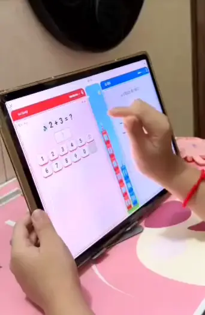
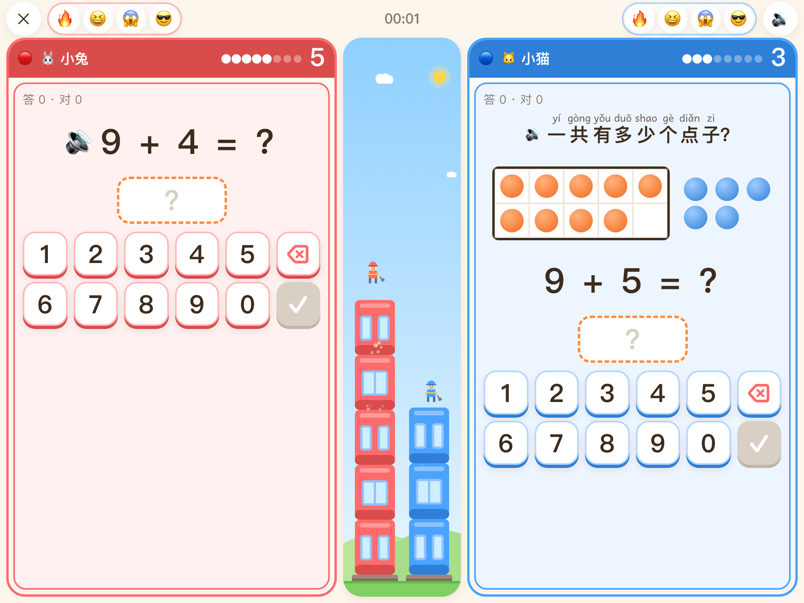
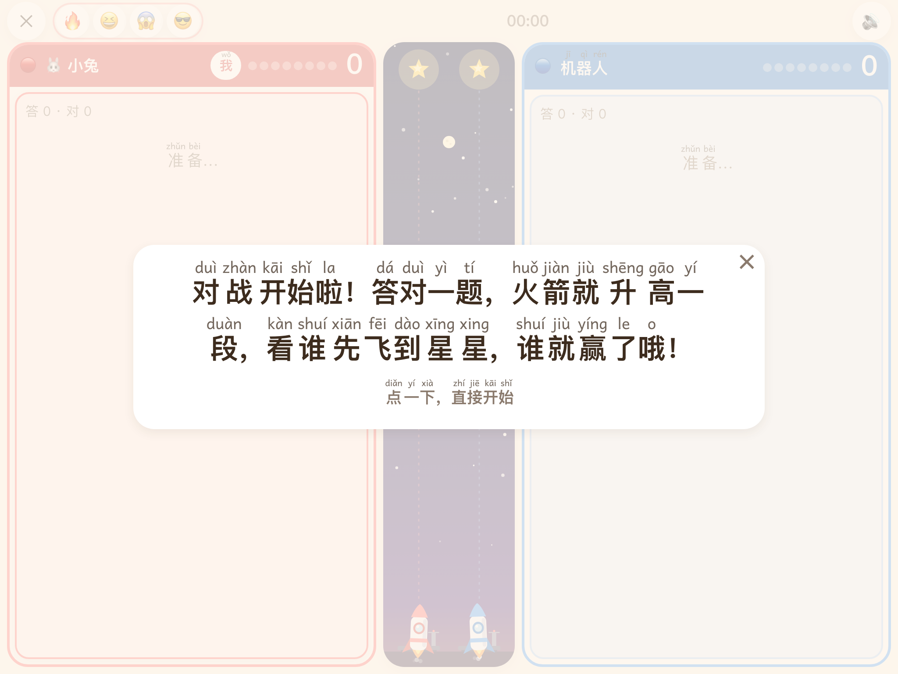
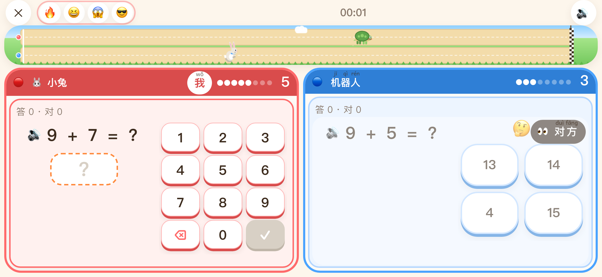
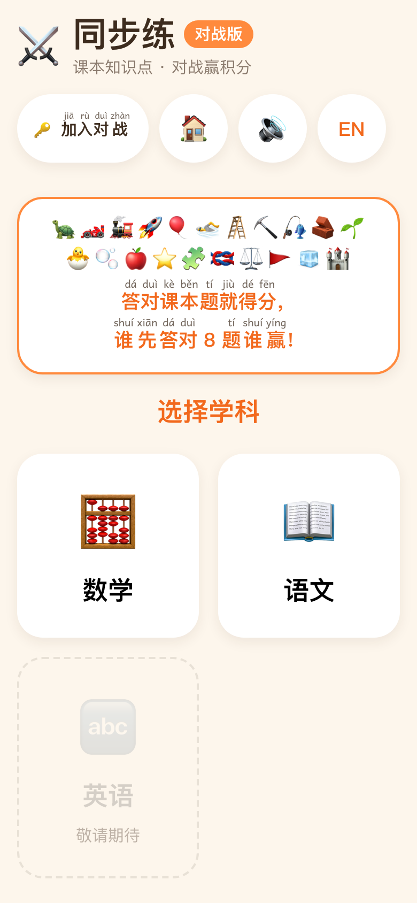
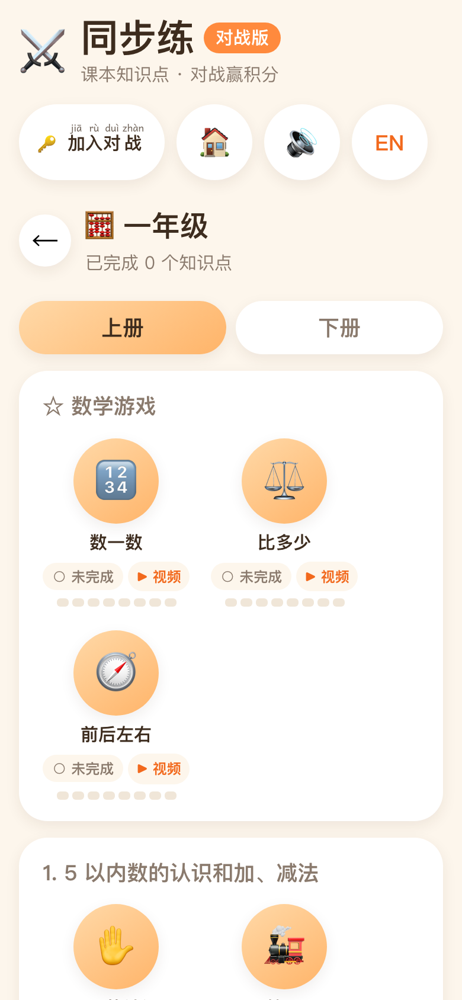
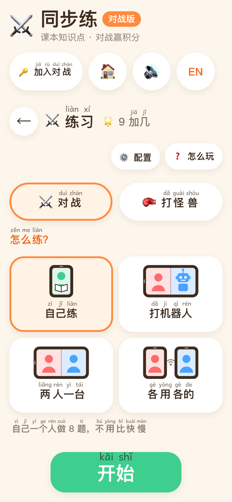
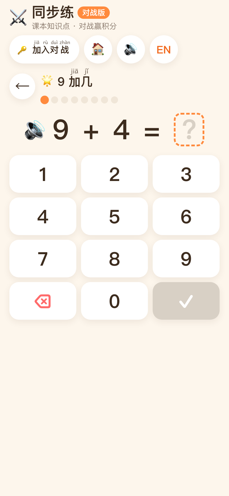
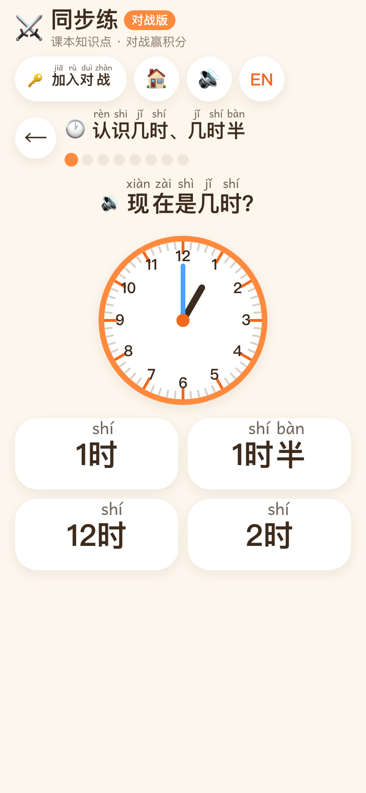
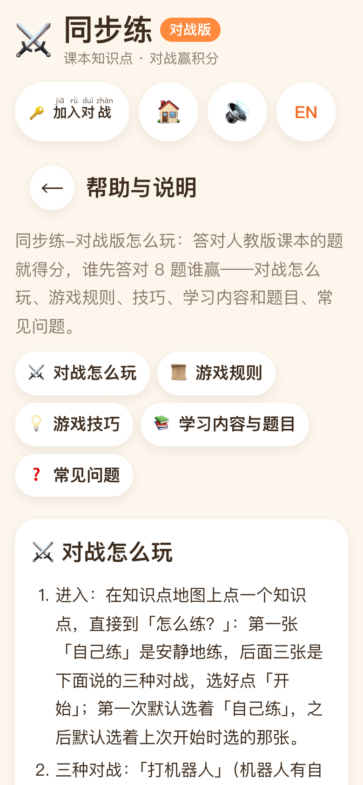

# 同步练-对战版

**儿童互动对战学习**：把**人教版官方课本的知识点测验**变成游戏积分——答对一题，小乌龟就往前跑一格、火箭升高一段、楼再盖一层……谁先答对 8 题谁赢。题目按**现行最新版人教版教材**（2022 版课标教材）的单元 → 知识点随机生成，一到六年级 × 语文 / 数学 / 英语；练的是课本，玩的是游戏，寓教于乐。可以打机器人、两人一台 iPad 同屏，或者每人一台设备扫码进同一个房间；不想比的时候，它就是一份安静的同步练习。

在线：**[tongbulian.jiaci.app](https://tongbulian.jiaci.app)**（手机 / iPad 打开后可以添加到主屏幕，像 App 一样全屏打开）

- **课本知识点 = 游戏积分**：对战和练习用的是同一套按教材出的题，每答对一题得 1 分，比分直接驱动游戏画面（赛跑、赛车、开火车、火箭升空、热气球、游泳、爬梯子、挖宝、钓鱼、盖楼、种花、孵蛋、吹泡泡、摘果子、点亮星星、拼图、拔河、跷跷板、抢旗、融冰、拆城堡，二十一种 canvas 实时绘制的小场景），连对 / 反超 / 冲刺有提示和音效，赢了撒彩纸。孩子以为在玩游戏，其实每一分都是一道课本题。
- **三种对战方式**：打机器人（三档快慢，会一个一个按数字、也会答错）；两人一台 iPad 左右同屏；每人一台设备扫码进同一个房间——红队 / 蓝队 / 观战，每队最多 6 人，两队齐了自动开始，结果页「下一章」接着打本册下一个知识点。
- **也能安静地练**：一轮 8 题，做完打勾。随机出题，不是题库：每个知识点一个生成器，题干配十格阵、实物图、钟面、人民币、图形、数轴、尺子（三年级有毫米尺）、竖式（加减乘，除法是课本的厂字形）、秤面、分数图、方格上的图形、统计表、月历、排队，四年级的计数器、算盘、量角器、条形统计图、藏宝平面图与指南针等可视化教具；答错当场用教具演示讲解（凑十法 / 破十法有动画）。
- **语文按课出题**：一、二、三年级语文按统编新教材（一上 2024 秋、一下 2025 春、二上 2025 秋、二下 2026 春、三上 2026 秋、三下 2027 春）每课一个知识点——识字课、汉语拼音、课文、古诗、文言文和每个单元的语文园地。题目只从这一课的生字、课文和拼音里出：听音选字、看拼音选字、看字选读音、看图选字、选词填空、课文问答、数笔画、第一笔、加一加 / 减一减、偏旁、反义词、古诗作者；拼音课还有第几声、拼一拼、找声母韵母、平舌翘舌、前鼻后鼻、字母表与音序；二年级再加词语表的看拼音选词语 / 听音选词语、多音字（词里标红的字怎么读）、近义词和部首查字法；三年级按课本的单元出略读课文、预测与寓言单元的问答、文言文的字词意思、古诗的注释与名言出处。考认字的字用田字格楷体、不注音也不读出来——注了音就等于把答案摆在眼前。
- **三年级数学**：按 2022 版课标新教材（三上 2026 秋、三下 2027 春）逐页读过课本出题——混合运算、毫米分米千米、克千克吨（曹冲称象的故事）、多位数乘一位数、数字编码、线和角、分数、轴对称 / 平移 / 旋转、除数是一位数的除法、长方形和正方形的周长、面积、复式统计表、年月日与 24 时计时法、小数。分数竖着排（分子在上、分母在下）、读「八分之三」；小数、分数的答案用选项卡；年份按位读「二零二四年」，14:30 读「十四点三十」。
- **四年级数学**：按 2022 版课标新教材四上（2026 秋）逐页读过课本出题——亿以内、亿以上数的读写（读法照课本：每级末尾的 0 不读，中间连续几个 0 只读一个零）、大小比较、改写成用「万」「亿」作单位的数与「四舍五入」求近似数、1 亿有多大、角的再认识与量角器读数、画角、多位数乘两位数（竖式照课本排出两次乘得的数）、积的变化规律、用估算解决问题、总量与分量 / 单价数量总价 / 时间速度路程三种数量关系、平行和垂直、平行四边形和梯形、单式与复式条形统计图、八个方向（寻找宝藏）。国家中小学智慧教育平台上的四年级下册还是旧版课本，新版出来之前只有上册。
- **识字不多也能自己玩**：题目里的汉字都标拼音（语文考认字的那个字除外），每道题自动朗读（预先合成好的语音片段拼播，不依赖浏览器 TTS）；对战里让孩子照着做的提示（怎么练、你叫什么、扫码进入、等大家进来、输口令……）在出现的那一刻也会读出来。
- **没有惩罚**：练习不计时、不扣分、没有排行、没有解锁链；对战答错不扣分、不锁题，输了只写「差一点点！」，也不改练习进度、不存战绩。
- **纯前端、不要账号**：进度只存在本机浏览器里，`dist/` 放到任何静态托管就能跑；只有对战的多设备模式需要一个小小的内存中继服务（仓库 `server/`）。
- **开源、干净**：代码全部以 MIT 许可公开在这个仓库里，谁都能查、也能自己部署一套；免费、无广告、不用注册、不收集个人信息。首页底部和每张静态页页脚都写着这一句并链到仓库；「分享给朋友」一键调系统分享面板（微信里教用右上角菜单，电脑上复制一段话），对战结果页还能「分享战绩」。
- **配老师讲的视频课**：知识点地图上每个知识点的完成状态旁边有「▶ 视频」，新窗口打开[国家中小学智慧教育平台](https://basic.smartedu.cn)上这一节的同步课，先听老师讲，再来练、来对战。平台上还没有新教材这一节同步课的，先链到新教材的精品课或旧版教材里对应的课，用虚线框标出来（旧版教材的写「▶ 旧版」）。
- 界面中文 / 英文一键切换，题目、拼音、朗读都跟着切。

**目前内容**：一年级数学 31 个知识点、二年级数学 33 个知识点、三年级数学 46 个知识点、四年级数学 22 个知识点（上册）、一年级语文 76 个知识点、二年级语文 71 个知识点、三年级语文 67 个知识点全部可练可对战，单元、小节与题目内容按国家中小学智慧教育平台上的 2024–2027 年新版电子课本（数学含「数学游戏」和带 ☆ 的综合与实践；语文每课一个知识点，外加每个单元的语文园地；清单见[知识点清单](#知识点清单)）；其它年级和英语在目录里占位「敬请期待」，逐步补。

<p align="center">
  <a href="screenshots/demo.mp4"></a>
</p>
<p align="center"><sub>实拍：两个小朋友在一台 iPad 上对战，各答各的题，谁先答对 8 题谁赢——点图片看带声音的视频（<a href="screenshots/demo.mp4">demo.mp4</a>）</sub></p>

<p align="center">
  
  
</p>
<p align="center"><sub>iPad 横屏：两人一台，左右各答各的（盖楼；没改过名字就是随机分到的小动物，两边不一样）· 开局先讲一句游戏规则，说完再倒数，点一下规则卡就直接开始（火箭升空）</sub></p>

<p align="center">
  
</p>
<p align="center"><sub>手机横屏（紧凑版）：打机器人，对方那一行实时显示它在答什么（赛跑）</sub></p>

<p align="center">
  
  
  
</p>
<p align="center"><sub>手机：首页选学科 → 知识点地图 → 点一个知识点就到它的「练习」页，选「怎么练」（自己练 + 三种对战）</sub></p>

<p align="center">
  
  
  
</p>
<p align="center"><sub>练习：9 加几（数字键盘）· 认识几时、几时半（钟面 + 四选一）· 帮助与说明</sub></p>

## 快速开始

```bash
npm install
npm run dev          # http://localhost:5173（启动前自动生成搜索引擎用的静态页）
npm run build        # vue-tsc --noEmit && vite build → dist/
npm run preview
npm run typecheck    # vue-tsc --noEmit
npm test             # vitest run：生成器多种子自洽、拼音对齐、语料一致、题目渲染、整站集成、对战状态机与中继服务
npm run test:watch
npx vitest run src/content/math/grade2/generators/__tests__/generators.test.ts   # 单个文件
npx vitest run -t "凑十"                                                          # 按用例名过滤
```

素材与核对工具（改了对应的东西才需要跑）：

```bash
npm run audio          # 重建朗读音频包（改了题目文案 / 生成器 / 外壳固定句之后；需要 pip install edge-tts numpy 并联网）
npm run seo            # 按目录重新生成搜索引擎用的静态页与 index.html 里的简介（build / dev 前会自动跑）
npm run og             # 用无头 Chrome 重新渲染分享图 public/og.png（加了年级 / 学科之后）
npm run videos         # 从国家中小学智慧教育平台的公开数据重新生成知识点 → 课程视频的对照表 src/content/videos.ts（新教材同步课；没有的标成替代视频：新教材精品课或旧版教材里对应的课；要联网）
npm run screenshots    # npm run dev 之后：无头 Chrome 模拟 iPhone / iPad 截 README 用的预览图到 screenshots/（安装对话框用的两张同时复制到 public/screenshots/）
npm run battle:survey  # npm run dev 之后：每种「题干 × 作答方式」在 iPhone / iPad 横屏各截一张并拼图，肉眼核对对战排版；加 -- practice 查练习页
npm run game:survey    # npm run dev 之后：每种游戏在几个比分 / 倒数 / 胜利 / 手机紧凑版各截一帧并拼图
npm run boss:survey   # npm run dev 之后：打怪兽在几种屏幕 × 玩法下的关键画面拼图；加 -- questions 查每种题型在打怪兽布局里放不放得下
npm run boss:online   # npm run build:server 之后：自己起中继服务与 dev 服务器，三个无头浏览器走一遍多设备的打怪兽（建房 → 扫码进来 → 自动开始 → 同步 → 时间到 → 再来一局）
npm run build:server   # 打包对战中继服务 → dist-server/battle.mjs
npm run battle:dev     # 打包并在本机 127.0.0.1:8787 起中继服务（dev 服务器把 /ws 代理过去）
npm run voice:check    # 语音联调：自己起中继（8788）与 dev 服务器（5199），三个无头 Chrome 带假麦克风真的连一遍（先 npm run build:server）
```

## 孩子怎么用

首页顶部栏是「⚔️ 同步练」+「对战版」标记，标题下面一条每种游戏的图标和一句「答对课本题就得分，谁先答对 8 题谁赢！」（带拼音）；顶栏的「🔑 加入对战」输口令就能进别人建的房间。

1. 选学科 → 选年级（上线的年级每一册一张卡，画着那本课本的封面，点哪一张就进那一册）→ 进入**知识点地图**（上册 / 下册两个页签，每个单元一张卡，知识点是圆形节点；当前册记在地址里，从题目返回还在同一册）。
2. 点一个知识点，直接到它的「练习」页，问「怎么练？」（带拼音，会读出来）：第一张「自己练」默认就选着，点「开始」开始练习，一轮 8 题，进题自动读题干，🔊 可以再听一遍；用**数字键盘**或**四选一卡片**作答；答对撒花、夸一句，答错读出并显示正确答案（有教具的知识点会演示一遍），点「我知道了」继续。一轮做完是结算页，和对战的结果页一样三个按钮：「下一章」（本册的下一个知识点）、「再练一次」、「不练了」。练习页排得紧凑（顶部栏在这一页缩小一号），常见手机竖屏上题目、教具和作答区一屏放得下，答错时连同讲解也不用往下滚。
3. 做完一轮就算「已完成」，地图上打勾。没做完的节点下面有 8 格进度条和这一轮的「x 题 · 对 y · 错 z」，中途退出下次接着做；做完的显示那一轮的对错数，再进去就开新的一轮重新计。家长也可以在地图上直接点状态标签手动标记 / 取消，不用做题。
4. 想比一比：点知识点后在「怎么练」里选打机器人、两人一台或各用各的，开始。第一次默认选着「自己练」，之后默认选着上次开始时选的那张。

没有解锁、没有星星、没有排行，不计时、不扣分，想练哪个点哪个；顶部栏的 🔊 / 🔇 可以关掉声音。每个知识点内部分三档难度，一轮里按约 60% 当前档、25% 低一档、15% 高一档混合出题（当前档暂固定为第 1 档，没有更低档，实际 85% / 15%）。

应用里有一页「❓ 帮助与说明」（首页底部、对战设置页页头的「怎么玩」都能进），分对战怎么玩、游戏规则、游戏技巧、学习内容与题目、常见问题五节，中英文随界面切换；在线版另有一张不用 JS 的静态页 [tongbulian.jiaci.app/help/](https://tongbulian.jiaci.app/help/)。

## 对战模式

对战的题和练习页是同一套生成器按教材知识点出的（同一个知识点、同样的难度档），只是把「答对」变成了「得分」：🔴 红队和 🔵 蓝队各答各的，**谁先答对 8 题谁赢**；答错不扣分、不锁题，1 秒多显示正确答案就出下一题。对战不改地图上的练习进度，也不存战绩。

### 怎么练

点知识点就到这一页（标题「⚔️ 练习」+ 知识点名，下面问「怎么练？」）：顶上两个玩法页签「⚔️ 对战」「🥊 打怪兽」（打怪兽见下面一节），对战页签里四张卡（自己练、打机器人、两人一台、各用各的，各画一幅示意图，一眼看出模式；手机竖屏上两排各两张）和「开始」，第一次默认选着「自己练」，之后默认选着上次开始时选的那张；机器人快慢、选游戏、改名字都在页头「⚙️ 配置」里。

- **打机器人**：机器人有自己的题，按 🐢 慢 / 🐰 中 / 🚀 快三档节奏答题，会一个一个按出数字、也会答错，还有表情（🤔 想题、🤖 在按、😄 答对、😅 答错）。进题自动读题。
- **两人一台**：一台 iPad / 电脑横着放，左右各一个人的题和键盘，可以同时按（上面的实拍视频就是这种）。不自动读题，点 🔊 读自己的；点了就一定读完，另一边这时点了排在后面接着读。
- **各用各的**：每人一台设备，进同一个房间（见下一节）。用 `file://` 打开或托管方没有中继服务时这张卡置灰。

**竞技场一律横向**：左区红队、右区蓝队，游戏画面在上方横条或左右之间的竖条（游戏说了算）；每人一行题目 + 键盘 / 选项卡。两队一眼分清：队区整块队色描边，队名条实心队色白字，题目里的按钮白底、队色描边、队色底边；自己那一队的队名条上标「我」，本机不能操作的行蒙一层半透明遮罩、右上角写「对方」或「队友」（两人一台两边都是自己，不标不蒙），只观战的设备顶栏写「👀 观战中」。手机竖着拿会提示横过来，横屏用紧凑版布局（题干与键盘左右并排，键盘按栏高缩放）；平板 / 手机进竞技场会试着全屏（电脑不会）。

**名字**：开始前什么都不问，点「开始」就打。没自定义过的，每一方随机分到一只小动物、名字就叫它（🐰 小兔、🐱 小猫……），两边一定不一样（多设备时撞了由服务器给后进来的人换一只）；每次打开页面随机一次，同一次里再来一局、下一章不变。想用自己的名字或小动物，在「⚙️ 配置」里改（名字可以输入或点现成的 🐰 小兔、🐯 小虎……，两人一台的右边也在那里，「🎲 随机」回到随机），改过的优先。名字只显示、不朗读，播报用「红队 / 蓝队」。

### 各用各的：多设备房间

1. 一个人在设置页选「各用各的」→「建房间」，屏幕上就是三个二维码：左边红队、右边蓝队、下面观战，每个带 6 位数字口令、链接和「复制链接」；建房的这台设备先只观战。
2. 红队的人扫红队码、蓝队的人扫蓝队码进来（不方便扫码就点顶栏的「🔑 加入对战」输那个身份的口令；不问名字），先看到「三方连接状态」窗口：红队、蓝队各有谁、观战几人，没到的一方写「等待连接…」。二维码页上每个码下面也写着谁已进入；一队有人后，建房的设备可以「以另一队进入」自己上场，或「以观战方进入」只看。
3. **红蓝两队都有人进来就自动开始**，不用谁点开始。每台设备上都是完整的竞技场，**只有自己那一行能操作**，别人的行实时显示他在答什么、按了什么、对还是错；队伍比分 = 队里所有人答对的题数之和（每队最多 6 人，人数不要求相等），用时按服务器时钟算。
4. 结果页三个角色一模一样：「下一章」在同一个房间接着打这一册的下一个知识点（游戏换成那一章的，不用重新建房、重新扫码，可以一直打到这一册最后一个）、「再来一局」、「不玩了」（关掉房间，大家一起回地图）；谁先点就按谁的，三台设备一起变。

题目在各自设备上生成与判分（同一个种子，服务器只记谁答到第几题、对了几题）；断线自动重连并接回原座位（页面回到前台立刻重连）；一台设备只算一个人（同一个浏览器再开一个标签页会顶掉先开的）；主持人（建房的设备）掉线 20 秒内回来不换人，超过才把主持权交给最早在线的人。房间只在服务器内存里（没人 10 分钟或建房 3 小时后销毁），不落库、不记内容日志；链接 `#/battle/<房间号>?t=red|blue|watch`，房间号本身就是密钥。页面版本比服务旧时自动更新重载再进，连不上时提示检查网络。

### 语音通话

不在同一个屋子里的人可以开麦说话（两台设备在一个屋子里会啸叫，不用开）。只有「各用各的」有：**房间里每个人自动能听到开了麦的人说话**，不用点任何东西；连接状态窗口、二维码页底部和竞技场顶栏各有一个 🎤 键只管自己的麦克风，**点了才会向浏览器要麦克风**（进房、重连、刷新后都是关着的，绝不自动开），开着带绿圈、自己说话时脉动，开了麦的成员名字旁边也有一颗小 🎤、他说话时跟着动；再点一下关掉并释放麦克风，还能继续听。开 / 关、拒绝了权限、浏览器不支持（微信内置浏览器要换到系统浏览器打开）、名额满了（一个房间最多 4 个人开麦）都会写一句并朗读。

声音是浏览器自带的 WebRTC **点对点**传的（Opus，开着回声消除、降噪、自动增益），端到端加密，不经过中继服务；开了麦的人向房间里每个人各发一路（最多 6 路，开了麦的优先），中继服务只帮双方交换连接信息，不存、不记。默认只用公共 STUN，同一 WiFi、普通家用宽带都能直连；手机流量对手机流量这类运营商 NAT 要 TURN 中继，托管方给服务配了 TURN 密钥才有（见「部署」），没配就只有 STUN。

🎤 上的小点是连接状态（绿连上、红连不上、灰闪连接中），下面会写「语音连接中…」「语音连不上对方」或「人太多了，这台设备听不到语音」（每个开了麦的人最多连 6 个人）；麦克风被系统收回（切到后台、来电、别的应用占用）会自动关掉并提示，再点一下重新打开；别人说话时题目朗读会压低一点。

### 游戏画面

每答对一题：队区闪一下队色、飘一个「+1」、比分弹一下、队名下的 8 颗进度点亮一颗，游戏画面同时发生一次看得见的变化；连对 2 题起有 🔥 ×n，「叮」的音高越来越高；连对 3 / 5 题弹「连对 n 题！」、从落后变领先弹「反超啦！」、到 4 分「到一半啦！」、到 7 分「还差一分！」（都朗读）；7 : 7 弹「决胜题！」+ 心跳声，竞技场四周红蓝呼吸光；到 8 分先定格半秒，再把游戏画面放大两倍、镜头跟着赢的那个角色播完到站 / 冲线 / 开花的动画（终局特写），同时全屏撒队色彩纸、播报队名再接一句游戏话（「火箭飞到星星啦！」），3 秒后出结果页。本设备第一次进某个游戏先讲一句规则（「对战开始啦！答对一题，火箭就升高一段，看谁先飞到星星，谁就赢了哦！」，同一个游戏一天内不重复，再来一局也不讲），说完再倒数。

**一题里的角色表演**：角色不只在得分时动，一题从头到尾都在演。等答题时一直在呼吸、重心晃，隔两三秒做一个这个角色的小动作（张望、挠头、伸懒腰、蹦两下、挥手……），等了 4 秒还没按，头顶冒一个「…」的想的泡泡（只是「在想呢」，不计时、不催）；一按数字键头顶亮一个灯泡，身子前倾蓄力，每按一下压一下（赛车踩一脚油门冒口烟、火车「嚓」地喷一口蒸汽、热气球烧嘴喷一下火……）；答对先蓄力压扁、跳起来、落地、举手欢呼，笑眯眯地迸一圈亮片（连对 3 / 5 题翻个跟头）；答错一愣、瞪眼冒汗、摇摇头、甩一甩，1 秒多就重新站好——是「哎呀」不是罚，不后退、不丢分（赛车熄火冒口黑烟、火箭火苗一哑、游泳呛一口水、爬梯子手一滑又抓住、挖宝的镐碰到石头弹回来……）。开了「减少动画」时不跳不晃，只留举手、表情和头顶的小图标。

现在有二十一种游戏，每种都是一个有背景、有一直在动的小装饰、有待机 / 得分 / 冲刺 / 胜负动作的小场景，全部用 canvas 实时绘制（矢量角色、粒子、缓动，没有图片）：

| 游戏 | 位置 | 场景 | 得 1 分（连对 / 被反超） | 冲刺（到 6 分起）与到 8 分 |
|---|---|---|---|---|
| 🐢🐇 赛跑 | 上方横条 | 天空、太阳、飘云、山丘与小树，两条草地跑道各 8 个蘑菇标记（跑过就亮），举旗的发令员小猴、格子终点柱 + 彩旗拱门 + 观众 | 自己的动物向终点跑一格、扬尘、拖速度线；连对加速；被反超的回头看 | 终点旗挥得更快、横幅发光；冲线喷彩纸、观众跳起来，胜方转圈 / 后空翻，负方缩壳 / 耷拉耳朵 |
| 🏎️ 赛车 | 上方横条 | 柏油路、红白路肩、车道虚线、黑白格子终点线，发令员和观众 | 队色赛车向前跑一格、辐条轮子按距离转、车身微颠冒尾气；连对喷氮气尾焰、车头微翘；被反超的司机回头看 | 还差一分终点旗猛挥；冲过格子线翘头蹦、撒彩纸，输的熄火一股一股冒黑烟 |
| 🚂 开火车 | 上方横条 | 左边一座大山、山底下的隧道洞与石门柱、信号灯，两条铁轨（碎石、枕木、钢轨），右边是对面的车站：站台、雨棚、站牌钟、铃、三只乘客和举旗的站长 | 队色蒸汽小火车（车头 + 8 节客车 / 敞车）从隧道里再开出一节车厢，烟囱冒白烟、轮子和连杆转、车身微颠；连对鸣笛、烟更密；被反超的司机回头看；倒数整列藏在隧道里只见车灯的光束，开始信号变绿、鸣笛开出来 | 还差一分站牌钟发光、铃响；8 节全开出来后一路开到对面的车站停在雨棚下：两侧喷蒸汽、鸣笛、铃摇、站长举旗、乘客跳起来、撒彩纸；输的熄火，司机耷拉着一股一股冒黑烟 |
| 🚀 火箭升空 | 左右之间 | 星空里各按节奏闪的星星、带环的行星、月亮、隔几秒划过的流星，两列各有发射台、虚线导轨和顶上带光晕的目标星 | 升高一段、喷大火向下冒烟；连对火更大；被反超晃一下 | 目标星脉动；抵达时星星炸成光芒、放三轮队色烟花、火箭绕小圈，负方断火冒黑烟微微下沉 |
| 🎈 热气球 | 左右之间 | 从浅蓝到深蓝的天空、太阳、山丘、飘云，顶上一层厚云是目标，小鸟飞过 | 烧嘴爆燃冒火星、升高一段，篮子里的乘客挥手；连对烧得更旺；被反超的回头看 | 还差一分云层发光；飞到云上再往上飘、连撒三轮彩纸，输的火熄了、球囊瘪一点往下沉 |
| 🏊 游泳 | 上方横条 | 俯视的泳池：瓷砖甲板上有遮阳伞、救生圈、吹哨的发令员和观众，红上蓝下两条泳道、珠子分道线、池底 8 块地砖标记、队色出发台、池壁的黄色触板，水面亮纹慢慢漂 | 戴泳帽泳镜的青蛙 / 小鸭向前游一格：手臂轮流划水、脚下打出水花、头前推出白浪，地砖亮起；连对划得更急；被反超的回头看；倒数蹲在出发台上、开始跳水入池溅水花 | 还差一分触板发光；一掌拍到触板亮一闪、溅水花、撒彩纸、观众跳起来，胜方举手蹦，输的仰面漂着蹬腿 |
| 🪜 爬梯子 | 左右之间 | 天空、太阳、飘云、山丘草地，正中一棵大树，树冠里的树屋平台上插着红蓝两面旗，两架木梯从草地竖到平台各 8 级，小鸟飞过、叶子飘落 | 猴子 / 熊猫往上爬一级：手脚交替、踩到的横档弯一下、梯子微晃、掉碎叶；连对爬得更快更晃；被反超的回头看；倒数在梯子脚下蹦 | 还差一分领先方的旗子发光、冲刺两面旗猎猎飘；爬上平台拔起自己的旗举着挥、连撒三轮彩纸，输的挂在横档上晃腿仰头看 |
| ⛏️ 挖宝 | 左右之间 | 顶上一条天空与草地，往下八层颜色不同的土层（石子、树根、骨头化石、闪光的宝石，蚯蚓不时探头），两口竖井各有木架滑轮和绳子，井底埋着宝箱隔着土隐约可见 | 戴安全帽和头灯的鼹鼠 / 獾往下挖一层：抡镐、泥土往上迸、井加深；连对抡得更急；被反超的抬头看；倒数在草地上蹦、开始抡一镐 | 还差一分领先方的宝箱闪光、冲刺宝石一闪一闪；挖到宝箱箱盖弹开、宝石喷三轮、举镐欢呼，输的在井底坐下、头灯一闪一闪 |
| 🎣 钓鱼 | 左右之间 | 天空、太阳、飘云，水面上两段木码头，红队小猫、蓝队小熊坐在码头边举着钓竿，线上的浮漂浮在水面；水越深越暗，底下是沙地、贝壳、海星，水草随水摇、气泡往上冒、杂鱼游过；两条队色的卡通鱼一开始在最深处 | 收一截线：钓竿弯一下、绕线轮转，鱼被拉近一截、头朝上挣扎摆尾冒气泡；连对收得更快；被反超的回头看；倒数鱼在水底横着游、钓鱼人坐着蹦，开始一起甩线 | 还差一分领先方的浮漂发光、冲刺鱼挣得更凶；胜方的鱼被拉出水面溅水花、飞到举起的手里、撒三轮彩纸，输的鱼在原地慢悠悠地游、钓鱼人挠头 |
| 🧱 盖楼 | 左右之间 | 白天的天空、太阳、飘云、飞鸟、山丘草地，两块地基上各站一个戴队色安全帽的小工人（待机抡锤） | 一块带窗户的队色砖从天上掉下来弹两下、扬尘、整座楼压一下再弹回，工人跳上新楼顶；一次跳几层就逐块错开落；连对砖掉得更急；被反超的工人挠头看过去 | 楼顶上方一颗星星闪；封顶时屋顶落下、插队旗、窗户从下往上亮成暖黄、放烟花，工人在屋脊欢呼，负方工人在没盖完的楼顶坐下 |
| 🌱 种花 | 左右之间 | 天空、太阳、飘云、山丘、白栅栏、草地，两只队色花盆里各一株小芽，小蜜蜂不时飞过 | 洒水壶斜过来浇一下（水滴落下），茎往上冒一截、多长一片叶子（左右交替弹出来），7 分鼓出花苞；连对浇得更多；被反超的晃一下；倒数花盆蹦、开始各浇一下 | 还差一分领先方的花苞一亮一亮、冲刺植株摇得更欢；开花时队色花瓣绕着黄花心弹开、亮片三轮、两只蝴蝶绕着花飞，输的植株垂下头 |
| 🐣 孵蛋 | 左右之间 | 天空、太阳、飘云、小红谷仓、木栅栏、干草地，两个草窝里各一只蛋，窝后站着系队色头巾的母鸡，小鸟飞过 | 8 步孵出来：1–3 分裂缝一道道多起来，4–5 分裂出小洞、小鸡的嘴探出来，6–7 分壳顶被顶起露出眼睛；每得分母鸡扑翅膀、蛋晃两下、蹦出碎壳；连对晃得更凶；被反超的母鸡歪头；倒数蛋轻轻摇、母鸡蹦 | 还差一分领先方的蛋一亮一亮、冲刺母鸡不停扑翅膀；小鸡顶开壳跳到窝边（壳顶扣在头上当帽子）、蹦着拍翅膀、羽毛彩纸三轮，母鸡张开翅膀；输的小鸡只从洞里探头眨眼、母鸡歪着头 |
| 🫧 吹泡泡 | 左右之间 | 天空、太阳、飘云、山丘、开着小花的草地，两只小动物举着泡泡棒，空中总有小泡泡往上飘，顶上一排小星星是「顶」 | 鼓起腮帮子吹一口，泡泡棒冒出小泡泡，大泡泡颤着大一圈、往上飘一截；连对吹得更猛；被反超的回头看；倒数原地蹦、开始一起吹 | 还差一分那一边的星星一亮一亮、冲刺泡泡晃得更明显；碰到顶变成彩虹泡（慢慢转）、亮片三轮、举棒欢呼，输的泡泡停在半空、又吹出一颗小的 |
| 🍎 摘果子 | 左右之间 | 天空、太阳、飘云、山丘、草地，正中一棵大果树，左半边 8 个红苹果、右半边 8 个蓝李子，树下两只小动物各守一只篮子，叶子飘落、小鸟飞过 | 自己那半边掉下一个果子，弹进篮子堆起来，摘果子的跳起来够一下、树冠晃、飘下叶子、篮子颠一下；一次跳几个逐个错开落；连对树晃得更厉害；被反超的回头看；倒数在篮子边蹦、开始一起跳树抖 | 还差一分领先方的篮子发光、冲刺树冠一直晃；篮子装满冒光芒、亮片三轮、举起篮子欢呼、小鸟落到树上，输的挠头、一片叶子落头上 |
| ⭐ 点亮星星 | 上方横条 | 夜空里几十颗按各自节奏闪的小星星、一弯月亮、山的剪影，两串各 8 颗高低错落的大星星，左端小云上坐着举魔法棒的小动物 | 挥一下魔法棒，一点火花从上一颗星飞到下一颗，那颗星「啪」地亮起来弹一下、迸亮片；连对火花更急；被反超的回头看；倒数在云上蹦、开始一起挥棒 | 还差一分下一颗要亮的星一闪一闪、冲刺小星星闪得更快；8 颗全亮时连线一段段亮起来连成图案、星星一波波地闪、亮片三轮，输的靠在云上睡着了、头顶冒小星星 |
| 🧩 拼图 | 左右之间 | 红队的板顶到最上、蓝队的顶到最下，中间空开，板框是队色、角上有队色圆牌；各 2 列 × 4 行共 8 块带凸凹扣的拼图，一开始只有虚线格子；红队拼「太阳笑脸与山丘」、蓝队拼「水里的大鱼」，两只小动物在中间各守自己的板 | 一块拼图从画面外飞进来、带点过冲地扣进格子，边亮一圈、迸亮片，小动物跳一下；一次跳几块逐块错开飞；被反超的回头看；倒数在板下蹦 | 还差一分剩下的最后一格一闪一闪、冲刺已拼好的部分微微发光；拼完整幅图从暗变亮、板框发光、亮片三轮、蹦着欢呼，输的守着没拼完的板挠头 |
| 🪢 拔河 | 上方横条 | 草地、太阳、山丘、小树，正中一条中线和一个水坑，两头各两只观众；两队各两只穿队色背心的小动物（熊 + 猪对熊猫 + 猴）抓着一根粗麻绳 | 绳子正中的蝴蝶结向自己这边弹一截（**位置 = 比分差**，翻盘感强），自己这队猛拉后仰、对方踉跄打滑扬尘；被反超的队冒汗 | 绳子绷紧发抖、还差一分蝴蝶结发光；负方被拖过中线摔进水坑溅水花，胜方松手蹦着欢呼、撒彩纸，绳子落地 |
| ⚖️ 跷跷板 | 上方横条 | 公园：天空、太阳、飘云、山丘小树、草地，正中一个跷跷板（三角支座 + 木板 + 两头队色扶手），红队坐左头、蓝队坐右头 | 一个队色砝码从天上掉到自己这头的板上弹一下、沿板从外往里排，板子跟着倾过去（**倾斜 = 比分差**），沉下去那头的颠一下、翘起来那头腿悬着晃；连对板子抖；被反超的回头看 | 还差一分那头的扶手发光、冲刺两只都挥手；赢的那头压到底弹两下扬尘撒彩纸、举手欢呼，输的被翘到最高处抱着扶手瞪大眼睛 |
| 🚩 抢旗 | 上方横条 | 天空、太阳、飘云、山丘、草地，两头各一座队色城堡（城垛、塔楼、旗帜、城门），门前站着自己队的小动物，赛场上 17 个小石子标格子，正中一面白色星星旗 | 得分的跳一下，旗子往他那边蹦一格走一道小弧（**位置 = 比分差**），他的城堡旗帜挥一下；连对蹦得更急；被反超的回头看；倒数旗在正中原地蹦、开始一起跳 | 还差一分领先方的城堡发光、冲刺两座城堡旗帜猎猎飘；旗子飞到胜方塔顶插住变队色、烟花三轮、蹦着欢呼，输的城门放下来、挠头 |
| 🧊 融冰 | 左右之间 | 极光、飘雪、远处的浮冰，底下是有波纹的水面和游来游去的小鱼，两摞 8 块冰砖上各站一只系队色围巾的企鹅 | **化的是对方的冰**：对方最上面那块先裂再从上往下化掉、两侧淌水，对方的企鹅跟着往下沉；连对化得更快；被反超的企鹅皱眉冒汗 | 雪下得更急、对方只剩一块时那块冰一闪一闪；对方冰全化，企鹅扑通掉进水里仰面漂着蹬腿，胜方企鹅蹦着拍翅膀放雪花亮片，小鱼跳出水面 |
| 🏰 拆城堡 | 左右之间 | 天空、太阳、飘云、小鸟、山丘、草地，两座队色塔楼并排，各 8 块城砖 + 带城垛的塔顶插着队旗，塔顶上站着自己队的小动物和一门朝着对面的小炮 | **拆的是对方的塔**：我的炮开一炮（后坐、冒烟），炮弹画一道弧飞到对方塔顶那块砖，先裂再碎成几块飞走，对方的塔顶连人带炮往下落一层弹一下；一次几分错开几发；连对开炮更急；被反超的回头看；倒数在塔顶蹦、开始各放个空炮 | 对方只剩一块砖那块一闪一闪、冲刺炮口一直冒烟；对方塔塌到地上扬一大团尘土，输的坐在废墟上头顶转小星星，赢的塔顶放三轮烟花、举手欢呼 |

游戏按章节排定：一个年级的知识点按目录顺序轮流用这几种游戏（上册排完下册接着轮，换年级从头排起），换章节就换游戏；「⚙️ 配置」里可以换一种或「🎲 随机」，只算这一次，下次又回到章节的游戏。手机横屏的矮横条 / 窄竖条自动切成紧凑版，只留角色与轨道。游戏只看比分、不认识题目，和页面严格隔离（见「架构」的不变量）。

**表情与点游戏**：竞技场顶栏每队一排 4 个表情键 🔥 加油 / 😆 哈哈 / 😱 哇 / 😎 厉害（两人一台两排都有，打机器人 / 多设备只有自己那排，只观战的设备在时钟旁有一排），点了从自己这边飞向对方那边、一声「啵嘤」，🔥 还会读一声「加油！」；机器人会回应（收到表情回一个，反超 😎、被反超 😱，赢了 😎、输了给你 🔥）；多设备房间里表情经服务器转给房间里所有人，家长在主持设备上就能给孩子加油。游戏画面也能点：点一下那一队的角色它会有反应（火车鸣笛喷汽、乌龟 / 兔子跳一下、火箭喷一口火、企鹅拍翅膀……每种游戏各不一样），点按处一圈涟漪、小声放这种游戏的得分音，不计分；角色还会在点按处冒一个对话框说一句自己的台词（25 个角色各 3 句，都是催你答题的，比如乌龟「我爬得慢，你答得快我就追上啦！」、火车司机「快答题，火车要开到车站啦！」），带拼音并自动朗读，每个角色的声音快慢高低不一样（乌龟慢而低、兔子快而高）。

**本章战绩**：同一个知识点连着「再来一局」，结果页记「本章战绩：小兔 2 : 1 小猫」，先赢两局的名字旁出 🏆，换知识点或离开清零、不存本地。

**我的小动物**：每一方一只小动物（🐻 小熊、🐷 小猪、🐼 熊猫、🐵 小猴、🐰 小兔、🐱 小猫）：不选就随机、两边不一样，想固定就在「⚙️ 配置」里选（两人一台左右各选各的，「🎲 随机」回到随机）；名字旁、结果页都带它，赛车 / 开火车的司机、热气球的乘客换成它；多设备时随进房发给服务器，别人也看得到。

**机器人**：快慢默认「跟着你」——按你最近几题的平均用时定它的用时（略慢一点），你落后 3 分它再慢一截、领先 3 分它快一截，正确率也跟着你的（略低），每局都能打到六七分才见分晓；它还记得你上次在这一章的节奏（每打完一局机器人都记下这一局的逐题用时与对错，只记最近一次、只在本机），下一局从第一题起就按那个节奏来，答几题后再改跟这一局的；「⚙️ 配置」里仍可选固定的慢 / 中 / 快。它还会说话：自己反超「我领先啦！」、被反超「哎呀，被追上了」、你还差一分「别急别急」、输了「你太厉害了，再来一局吧」、赢了「这次我赢啦，再来一局？」，它那一行冒气泡（带拼音）同时朗读，声音调高一点像机器人；正在读题、读提示的时候它不出声（开局也不说话，免得压在第一题的读题上）。

**背景音乐**：比赛中放这个游戏自己的一首小曲子（振荡器与噪声现场合成，没有音频文件）：21 首各有各的调、速度、拍子和音色——赛跑是木鱼「嘚嘚」的蹦跳小曲，赛车是八分音符推进的小摇滚，火车是摇摆的「哐当哐当」，火箭和点亮星星是钟琴，热气球是飘着的华尔兹，钓鱼是慢悠悠的湖边小调，拆城堡是中世纪风……每首 8 小节一轮（十几到二十几秒），有旋律、低音、铺底和弦和鼓点，旋律的强拍都落在和弦音上；到 6 分冲刺时加快、鼓点加密，朗读和语音说话时压低，结果页停；各首按量出的响度拉平，听着差不多响。「⚙️ 配置」里可以关，🔇 静音时也不放。

**声音**：答对「叮」（连对时越来越高）+ 按游戏一声（赛车轰一下、火箭点火、砖落地咚、融冰咔嚓 + 水滴……）、连对再加一串亮晶晶的上行（赛车是氮气、火车是汽笛）、答错是这个游戏自己轻轻的「哎呀」（赛车熄火噗噗、火车漏气嘶、游泳呛水咕嘟、爬梯子往下一溜、挖宝的镐碰到石头叮、孵蛋咯咯哒、拼图「嗯？」……没有低沉的「咚」）、倒数「嘀嘀嘀」后「开始」是这个游戏的一声（发令枪、汽笛、点火、甩竿、小号、号角……）、自己每按一下数字键很轻的一声（赛车踩油门、火车喷蒸汽、火箭火苗、热气球烧嘴……机器人按键不出声）、弹出提示「啵」、胜利小号声加欢呼，都是 WebAudio 振荡器和噪声现场合成的，没有音频文件；得分音红队偏左、蓝队偏右（立体声），安卓上答对短震一下、答错震三下；每到一半（4 分）那一队的角色做一下「点一下」的小动作；规则句、弹出提示、播报用的是预合成的朗读片段。**屏幕上的提示语也会读**：「练习」页打开读「怎么练？」和当前那张卡的说明、换卡读那张卡的，问名字读「你叫什么？」，点 ✕ 读「要退出比赛吗？」；房间里二维码页读扫码说明、有人进来读「红队已进入…」、连接状态窗口读「等大家进来… 红蓝两队都进来就自动开始」，输口令面板、连不上、房间关了这些提示出现就读——还不太会认字的孩子靠听就知道下一步做什么（同一画面不重复读，🔇 时不读）。

**结果页**：上面一张战报卡，左边 🏆 谁赢、比分、用时、每人「答 n · 对 m」（输的一方写「差一点点！」）、本章战绩，右边「下一章 / 再来一局 / 不玩了」和「分享战绩」——手机横屏上整张卡在第一屏，不用往下滚找按钮；卡片下面是一条红蓝赛跑的比分走势（反超的地方打点），再下面列出这台设备答错的题（题干带拼音、正确答案，点了朗读；多设备只列自己的），最后一个「再练一遍」进这个知识点的练习页——题目流是确定性的，只记种子和题号就能重现，不存本地；三种模式都是「下一章」（最大，接着打本册下一个知识点、游戏换成那一章的，最后一个知识点写「这一册都打完啦！」）、「再来一局」（同样的人和游戏，换一组题）、「不玩了」（回地图）。

### 🥊 打怪兽：限时 Boss 战

另一种玩法，孩子之间不再互相比：在「练习」页顶上切到「🥊 打怪兽」页签，一起（或各自）打一只充气不倒翁恐龙「捣蛋龙」——它把大家的星星抢走了。

- **限时**：默认 90 秒（「⚙️ 配置」里可选 60 / 120 秒），题目不限量；最后 10 秒计时器变红、音乐加快、四周暖红的呼吸光，每拳多 1 分；时间到哨声一响就结束。顶栏的 ⏸ 可以暂停（题目盖住、计时和音乐都停，「继续打」先 3-2-1），切到后台也会自动暂停。
- **得分**：答对一题打一拳得 1 分；同一个人连着答对，第 3 题起每拳多 1 分；答错不扣分，这一拳打空、连击断掉（答错要等 1 秒多，蒙比想慢）。分数就是打在捣蛋龙身上的伤害，结果页同时写答对几题、最高连击。
- **Boss 链**：一只打倒（血量 5 / 10 / 15，之后每只 20；两个人翻倍、按时长缩放，打倒那一拳多出来的伤害算到下一只身上），下一只更大的马上登场——第二只戴泡沫头盔、第三只戴纸王冠、再往后是金色的；打倒几只就是几颗星（最多三颗）。
- **谁来玩**：一个人打（手机竖着拿也行）、和机器人（「一起打」时机器人当队友、跟着你的节奏再慢一点，「各打各的」时按配置里的快慢比得分）、两人一台（一左一右）；两个人可以选「一起打」（打同一只，1.5 秒内先后打中是合力拳，最后看谁得分最高、戴 👑）或「各打各的」（各打一条 Boss 链，比得分）；也可以各用各的设备：和对战一样建房间、扫二维码或输口令进来，「一起打」两个人到了就自动开始（最多 12 人），「各打各的」红蓝两队都有人就开始（每队最多 6 人）。计时以服务器为准，每台设备只放自己那一栏作答区，其他人缩成舞台下面的一排头像条（得分、正在按、连击、🎤）；台上每队最多两个人（最近打中的轮换上台），其他人坐在观众席举着自己小动物的牌子，答对了从观众席飞出一个发光的能量拳；表情、语音和对战一样能用。
- **竞技场**：舞台是主角——iPad / 电脑上舞台全宽、约 300 像素高，下面是作答区；手机横屏一个人时左舞台右作答、两个人时舞台在中间；顶栏是大号计时器（一圈进度）和打倒了几只。作答区和对战的一样（题干带拼音、数字键盘 / 选项卡），头部写得分（加分时飘一个 +n）和连击 🔥。
- **画面**：拳台、聚光灯、摇荧光棒的观众、角落一面锣；拳手就是自己的小动物（和机器人一起打时旁边是个小机器人），戴队色护头和拳套，动作是用「骨骼姿势片段」写的（弹跳晃拳、擦鼻子、蓄力、出拳、庆祝之间交叉淡入）。每按一个数字拳套亮一格（蓄力），答对立刻出拳，连击越高招式越大：直拳前冲一步；勾拳扭身抡一道弧，把捣蛋龙打得往侧后方歪；上勾拳先蹲再往上窜，把它打得离地弹起；第 5 题起是旋风拳，先转一圈再冲出去，拳套变超大，捣蛋龙转半圈、镜头往前推。两个人 1.5 秒内先后打中是合力拳：两只拳套一起打到、冒一圈金光，再朝对方举拳碰一下。捣蛋龙像不倒翁一样被打歪再弹回来、从布袋里迸出星星；第三只（戴纸王冠）会吹泡泡挡在肚子前，拳头先把泡泡打破再打中；血少了冒汗、蚊香眼；打倒时停一下再慢动作翻飞、泄气乱飞、缩小挥手蹦走，下一只从天而降；答错是挥空转一圈；没人打中它就轮流表演——跳挑衅舞、张大嘴吼（拳手被吹得往后仰、耳朵和护头带子飘起来）、从布袋里掏出果冻球扔过来（拳手一低头躲开）；时间到它一屁股坐下喘气、挥手跑掉。打不坏、不流血。
- **结果页**：一起打是「一起把捣蛋龙打倒了 n 次！」+ 星星，各打各的是比分 + 胜方；每人一行得分、答对几题、最高连击、合力拳，得分最高的 👑；一个人打会记下这台设备上每个知识点、每种时长的最好成绩，打破了写「🏅 新纪录！」（设置页「一个人打」那张卡上也写着最好成绩）；下面是每人一条的得分走势和我答错的题；同样是「下一章 / 再来一局 / 不玩了」。
- **声音**：一首自己的 Boss 战曲（小调、130 拍，最后 10 秒加快到 160）；开打是一声锣，出拳「嘭」（勾拳带风声、上勾拳往上一挑、旋风拳先蓄力再大轰）、打在充气恐龙身上「boing」（分越多音越高）、挥空「呼」、打倒时「噗——」泄气再接一小段胜利短句、时间到裁判哨；「打倒啦！」「第二只来啦，它戴着头盔！」「最后十秒，冲呀！」「时间到！」都朗读；6 秒没人打中，捣蛋龙轮流跳挑衅舞「来打我呀！」、吼一嗓子「嗷呜——我可厉害啦！」、扔果冻球「请你吃果冻！」；点一下捣蛋龙它咯咯笑「哈哈，好痒！」，点拳手、观众、锣也各有声音。

## 知识点清单

### 一年级数学

| 上册 | 下册 |
|---|---|
| ☆ 数学游戏：数一数 / 比多少 / 前后左右 | 认识平面图形：平面图形 |
| 5 以内数的认识和加、减法：1~5 的认识 / 第几 / 5 以内的分与合 / 5 以内的加、减法 | 20 以内的退位减法：十几减 9 / 十几减 8、7、6 / 十几减 5、4、3、2 |
| 6~10 的认识和加、减法：6~10 的认识 / 6~10 的分与合 / 10 以内的加、减法 / 连加、连减和加减混合 | 100 以内数的认识：数数、数的组成 / 数的顺序、比较大小 / 简单的加、减法 |
| 认识立体图形：立体图形 | 100 以内的口算加、减法：口算加法 / 口算减法 |
| 11~20 的认识：11~20 的认识 / 简单的加、减法 | 100 以内的笔算加、减法：笔算加法 / 笔算减法（竖式） |
| 20 以内的进位加法：9 加几 / 8、7、6 加几 / 5、4、3、2 加几 | 数量间的加减关系：两数相差几 / 比一个数多几或少几 |
| | ☆ 欢乐购物街：认识人民币 |

### 二年级数学

| 上册 | 下册 |
|---|---|
| 分类与整理 | ☆ 时间在哪里：认识几时、几时半 / 认识几时几分 / 时、分、秒 / 我与时间的故事 |
| 1~6 的表内乘法：乘法的初步认识 / 1~6 的乘法口诀 / 乘加、乘减 / 用乘法解决问题 | 有余数的除法：认识余数 / 有余数除法的计算 / 用有余数的除法解决问题 |
| 1~6 的表内除法：平均分 / 除法 / 用 1~6 的乘法口诀求商 / 用除法解决问题 | 数量间的乘除关系：倍的认识 / 用乘除法解决问题 |
| ☆ 校园小导游：认识东、南、西、北 / 校园小导游 | 万以内数的认识：1000 以内数的认识 / 10000 以内数的认识 / 大小比较和近似数 / 简单的加、减法 |
| 厘米和米：认识厘米和米 / 量一量 / 认识线段 | 万以内的加法和减法：加法 / 减法 / 加、减法各部分间的关系 |
| 7~9 的表内乘、除法：7~9 的乘法口诀 / 用 7~9 的乘法口诀求商 / 连续两问 | |

### 三年级数学

| 上册 | 下册 |
|---|---|
| 观察物体：从不同方向观察物体 / 猜一猜是什么立体图形 / 剪开长方体纸盒 | 生活中的运动现象：轴对称图形 / 平移 / 旋转 |
| 混合运算：只有加减或只有乘除 / 先乘除后加减 / 有括号先算括号里的 / 解决多步计算的实际问题 | 除数是一位数的除法：口算除法 / 笔算除法 / 商中间或末尾有 0 的除法 / 解决问题 |
| 毫米、分米和千米：毫米、分米的认识 / 千米的认识 / 估计距离 / 长度单位的换算 | 长方形和正方形：多边形 / 周长 / 拼图游戏 |
| ☆ 曹冲称象的故事：认识质量单位 / 称重我很行 | 图形的面积：面积和面积单位 / 长方形和正方形的面积 / 面积单位间的进率 |
| 多位数乘一位数：口算乘法 / 笔算乘法 / 有 0 的乘法 / 乘法估算 | 数据的收集与整理：数据的收集和记录 / 复式统计表 / 分段整理数据 |
| ☆ 数字编码 | ☆ 年、月、日的秘密：年历中的秘密 / 作息时间表中的秘密 |
| 线和角：线段、射线、直线 / 角的认识 / 直角、锐角、钝角 | 小数的初步认识：认识小数 / 小数的大小比较 / 简单的小数加、减法 |
| 分数的初步认识：几分之一 / 几分之几 / 分数的简单计算 / 进一步认识分数 | |

### 四年级数学

2022 版课标新教材（四上 2026 秋）；下册在国家中小学智慧教育平台上还是旧版课本，等新版出来再做。

| 上册 |
|---|
| 万以上数的认识：亿以内数的认识 / 亿以上数的认识 / 数的大小比较 / 数的改写和求近似数 |
| ☆ 1亿有多大 |
| 角的度量：角的再认识 / 角的度量 / 画角 |
| 多位数乘两位数：口算乘法 / 笔算乘法 / 积的变化规律 / 用估算解决问题 |
| 加法模型和乘法模型：总量与分量的关系 / 单价、数量和总价的关系 / 时间、速度、路程的关系 |
| 平行四边形和梯形：平行和垂直 / 点到直线的距离 / 认识平行四边形 / 认识梯形 |
| 条形统计图：单式条形统计图 / 复式条形统计图 |
| ☆ 寻找宝藏：校园寻宝 |

### 一年级语文

统编新教材，每课一个知识点（「我上学了」、快乐读书吧、口语交际不设）。

| 上册 | 下册 |
|---|---|
| 识字：天地人、金木水火土、口耳目手足、日月山川、语文园地一 | 识字：春夏秋冬、姓氏歌、小青蛙、猜字谜、语文园地一（汉语拼音字母表） |
| 汉语拼音：a o e、i u ü、b p m f、d t n l、语文园地二 | 阅读：热爱中国共产党、吃水不忘挖井人、我多想去看看、语文园地二 |
| 汉语拼音：g k h、j q x、z c s、zh ch sh r、y w、语文园地三 | 阅读：小公鸡和小鸭子、树和喜鹊、怎么都快乐、语文园地三（音序查字法） |
| 汉语拼音：ai ei ui、ao ou iu、ie üe er、an en in un ün、ang eng ing ong、语文园地四 | 阅读：静夜思、夜色、端午粽、语文园地四 |
| 阅读：秋天、江南、雪地里的小画家、四季、语文园地五 | 识字：动物儿歌、古对今、操场上、人之初、语文园地五 |
| 识字：对韵歌、日月明、小书包、升国旗、语文园地六 | 阅读：古诗二首（池上、小池）、浪花、荷叶圆圆、要下雨了、语文园地六 |
| 阅读：小小的船、影子、两件宝、语文园地七 | 阅读：文具的家、一分钟、动物王国开大会、小猴子下山、语文园地七 |
| 阅读：比尾巴、乌鸦喝水、雨点儿、语文园地八 | 阅读：棉花姑娘、咕咚、小壁虎借尾巴、语文园地八 |

### 二年级语文

统编新教材（二上 2025 秋、二下 2026 春），每课一个知识点（快乐读书吧、口语交际不设）。

| 上册 | 下册 |
|---|---|
| 阅读：小蝌蚪找妈妈、我是什么、植物妈妈有办法、语文园地一 | 阅读：古诗二首（咏柳、村居）、找春天、开满鲜花的小路、邓小平爷爷植树、语文园地一 |
| 识字：场景歌、树之歌、拍手歌、田家四季歌、语文园地二 | 阅读：雷锋叔叔，你在哪里、千人糕、我不是最弱小的、语文园地二 |
| 阅读：彩虹、去外婆家、数星星的孩子、语文园地三 | 识字：神州谣、传统节日、「贝」的故事、中国美食、语文园地三 |
| 阅读：古诗二首（登鹳雀楼、望庐山瀑布）、黄山奇石、日月潭、葡萄沟、语文园地四 | 阅读：彩色的梦、一匹出色的马、枫树上的喜鹊、语文园地四 |
| 阅读：坐井观天、寒号鸟、我要的是葫芦、语文园地五 | 阅读：寓言二则（亡羊补牢、揠苗助长）、画杨桃、小马过河、语文园地五 |
| 阅读：八角楼上、朱德的扁担、难忘的泼水节、刘胡兰、语文园地六 | 阅读：古诗二首（绝句、晓出净慈寺送林子方）、雷雨、要是你在野外迷了路、太空生活趣事多、语文园地六 |
| 阅读：古诗二首（江雪、敕勒歌）、雾在哪里、雪孩子、语文园地七 | 阅读：大象的耳朵、蜘蛛开店、青蛙卖泥塘、小毛虫、语文园地七 |
| 阅读：称赞、纸船和风筝、快乐的小河、语文园地八 | 阅读：羿射九日、黄帝的传说、大禹治水、语文园地八 |

### 三年级语文

统编新教材（三上 2026 秋、三下 2027 春），每课一个知识点（口语交际、习作、习作例文、快乐读书吧、专题学习活动不设；第五单元是习作单元，只有两篇课文）。

| 上册 | 下册 |
|---|---|
| 阅读：大青树下的小学、花的学校、不懂就要问、语文园地一 | 阅读：古诗三首（绝句、惠崇春江晚景、三衢道中）、燕子、荷花、昆虫备忘录、语文园地一 |
| 阅读：古诗三首（望洞庭、山行、夜书所见）、铺满金色巴掌的水泥道、秋天的雨、听听，秋的声音、语文园地二 | 阅读：守株待兔、会摇尾巴的狼、鹿角和鹿腿、池子与河流、语文园地二 |
| 阅读（预测）：总也倒不了的老屋、犟龟、小狗学叫、语文园地三 | 阅读：海底世界、石蜂、小虾、语文园地三 |
| 阅读：宝葫芦的秘密、在牛肚子里旅行、一块奶酪、语文园地四 | 阅读：古诗三首（元日、清明、九月九日忆山东兄弟）、纸的发明、赵州桥、一幅名扬中外的画、语文园地四 |
| 习作单元：搭船的鸟、金色的草地 | 习作单元：胡萝卜先生的长胡子、我变成了一棵树 |
| 阅读：富饶的西沙群岛、海滨小城、美丽的小兴安岭、香港，璀璨的明珠、语文园地六 | 阅读：童年的水墨画、肥皂泡、灰雀、我不能失信、语文园地六 |
| 阅读：古诗三首（鹿柴、望天门山、饮湖上初晴后雨）、大自然的声音、读不完的大书、语文园地七 | 阅读：火烧云、暴风雨来临之前、我们奇妙的世界、语文园地七 |
| 阅读：司马光、一定要争气、手术台就是阵地、一个粗瓷大碗、语文园地八 | 阅读：慢性子裁缝和急性子顾客、漏、枣核、语文园地八 |

## 拼音与朗读

- **拼音**：中文模式下练习页的所有汉字（题干、选项、页头、答错讲解、结算）都逐字注音（语文考认字的字除外：田字格里的大字、听音 / 看拼音 / 看图选字的楷体选项都是不带拼音的纯文字），字体用为初学者设计的 [Andika](https://software.sil.org/andika/)（单层 a / g，OFL，自托管）。每条中文词条配一条与汉字逐字对齐的拼音（各内容包的 `pinyin.ts`、`src/locales/shell.ts`），一 / 不按实际读音标变调，有测试保证音节数与汉字数相等。
- **朗读**：不用浏览器 TTS 读汉字。题目文字按「数字 / 汉字短语 / emoji 的名字 / 运算符与括号的读法」切成片段（`src/engine/speech.ts`），连续的短语、运算符和一个「槽」（一个数或一个 emoji 的名字）并成一条自然的话（「小猪 · 有14个 · 苹果，小狗 · 比小猪 · 少8个」「9 · 加5等于几」；一条最多一个槽，量词留在数字后面、动词 / 介词 / 连词贴向后面），逗号 / 句号变成停顿；每个片段是一条预先合成好的 mp3（`public/audio/`，Microsoft Edge 神经语音，来源见 `public/audio/CREDITS.md`），播放时整句按 AudioContext 的时钟一次排到时间轴上（片段之间 30 ms、停顿 280 ms），不是一条播完再起下一条：「9 + 5 = ?」读作「九 · 加 · 五 · 等于几」，「🐷 有 14 个 🍎，🐶 比 🐷 少 8 个」读作「小猪 · 有十四个 · 苹果 ，小狗比小猪 · 少八个」，「(3 + 4) × 5 = ?」读作「括号 · 三 · 加 · 四 · 括号 · 乘 · 五 · 等于几」，「🐰 从左数排第几个？」读作「小兔子 · 从左数排第几个」。100 以上的数按课本读法拆成几段（3005 → 三千 · 零 · 五），所以万以内的数不用每个都录一条。缺片段（比如刚加了新题型还没重跑脚本）才退回浏览器 TTS。
- **数的读法**：分数「3/8」画成上下两层、读「八分之三」（英文 three eighths）；100 以内的一两位小数、分数和前后的字并成一句读；年份按位读（2024 年 → 二零二四年），日期「3 月 5 日」读成「3月 · 5日」（「2 月」读「二月」，「2 小时」读「两小时」），中文里的时刻 14:30 读「十四点三十」；比大小的「○」读「和」。万以上的数按级读（21893095 → 二千一百八十九万三千零九十五），屏幕上照课本连写；四年级的记号读成字：60° 读「60度」、∠1 读「角1」、a // b 读「a 平行于 b」、a ⊥ b 读「a 垂直于 b」、≈ 读「约等于」、80米/分 读「80米每分」。英文界面的长度、质量单位写符号（mm、kg），合成时读成单词（millimeters、kilograms）。
- **提示语**：让孩子照着做的提示（知识点「练习」页的「怎么练？」与四张卡的说明、问名字、退出确认、房间页的扫码说明 / 连接状态 / 输口令 / 错误提示）在页面打开或切到那个功能时自动读一遍（`engine/voice.ts` 的 `sayKeys`），与读题共用一个独占通道，新的打断旧的；只有对战里点 🔊 读题例外——那句必须读完，期间另一方点的、自动读的新题、要读的提示都排在后面（连对 / 反超这类弹出提示则跳过）。写这类文案时注意「」括号会把句子切成几段，每段要是自然的短语，别用圆括号（会读出「括号」）。
- **音频包**：`npm run audio` = `scripts/collect-speech.mjs`（跑遍所有生成器与外壳固定句收集片段 → `src/audio/corpus.json`）+ `scripts/build-audio.py`（edge-tts 合成、裁静音、响度归一、转 24 kHz 48 kbps mp3 → `public/audio/` 与 `src/audio/manifest.json`），现在中文 39383 条、英文 22904 条，共约 625 MB（语文每个题目条目逐条收一遍，一到三年级的课文句子多；三、四年级数学的文字题、大数、小数与算式最多；短语里的数与 emoji 名字并进短语后片段是原来的 5–6 倍；嫌音频包大可以把 `src/engine/speech.ts` 的 `MERGE_MAX` 调小，或把音频脚本的码率从 48k 降到 32k）。有测试保证语料与代码一致、每个片段都有文件。多音字在个别上下文里被合成读错的（比如「从前数第几个」的「数」读成 shù；序数「第一声」「第一笔」「第一个」的「一」要读 yī，不能跟着「叫了一声」读成 yì；题目里的第几个、第几声也都用汉字写，阿拉伯数字夹在中文句子里合成出来是读数字的调子），合成脚本里有一张读法表，把送去合成的文字换成读音唯一的同音字，屏幕上的字不变；这些片段的文件名跟着换过的文字走，页面按一张小别名表找到它们，已经缓存过旧音频的设备也会重新下载。
- **语文的拼音与朗读**：课文、词语、问答的拼音不在词条里配，而是每个年级一张按上下文注好的拼音表（`content/chinese/grade<n>/py.ts`：键是句子或词语，值与汉字逐个对齐；轻声、一 / 不变调、多音字按课文里的读法——种田 zhòng、长出 zhǎng、盛满 chéng、雨点儿 yǔ diǎn r；单独一个生字按它在识字表里的读音，比如二年级《寒号鸟》的「重」读 chóng），测试查每课要用的都在表里、没有多余的。课文句子、听音的字词、图名、答案这些**中文内容在英文界面也用中文的声音读**（朗读片段带一个「用中文读」的标记）；拼音不让语音合成念字母——一个音节读一个读音唯一的同音字（bā 读「八」），声母韵母读课本的呼读音（b 玻、p 坡、m 摸）；听音题和答案里的多音字按这个字在本课的读音给个词读（「长短的长」「长大的长」「重复的重」）——「X 的 X」末尾单独那个字合成时也常读成最常见的音（高兴的兴读成 xīng），合成脚本把这些词的末尾换成读音唯一的同音字再合成。
- iOS / Safari 要在用户手势里解锁音频：任何一次触摸都会顺手解锁，之后自动读题不再受限；直接用地址打开练习页时第一题会等到第一次触摸才有声音。

## 部署

纯静态站：`npm run build` 后把 `dist/` 整个放到任何支持 HTTPS 的静态托管（nginx、对象存储、Pages 服务都行），不需要服务端；`base: './'`，放在子目录也能跑。

- **缓存与更新**：已注册 Service Worker（vite-plugin-pwa，`registerType: 'autoUpdate'`），预缓存只有页面外壳（代码、字体、图标，约 2.6 MB，几秒装好）；朗读片段不预先下载——练习页进来时只取这一轮要读的，读到哪条取哪条，取过的存进另一个缓存、再读就不用联网（文件名是内容哈希，页面打开后会把缓存里已经不用的旧片段清掉）。**不保证离线使用**：用过的内容断网时多半还能读，没用过的片段断网时退回浏览器 TTS。首页页脚最上面的版本卡片显示当前版本（构建时刻），点「检查更新」会和服务器上的 `version.json`（构建时一起生成）比对，有新版本就下载并自动刷新，没更新成功还能「重新安装」（清掉缓存重新下载，学习记录不丢）；重新部署后开着的页面回到前台会自己换新版本（在对战里就等退出竞技场再换）。自己部署时**必须是 HTTPS**（局域网 http 地址不行，Service Worker 不会注册）。
- **安装提示**：没从主屏幕打开时，首页顶上有一条「安装 同步练-对战版」提示（给家长看的，不出声、不遮按钮）：Android / 电脑 Chrome、Edge 点「安装」直接弹系统安装框；iPhone / iPad 点「怎么做」看步骤（Safari 分享 → 添加到主屏幕）；微信 / QQ 里教先在浏览器打开。关掉 3 天后再提示，装好了不再出现；电脑上只在能一键安装时提示。逻辑在 `src/engine/install.ts`（可单测）+ `src/stores/install.ts`，画在 `components/ui/InstallBar.vue`。
- **搜索引擎**：应用是 hash 路由，搜索引擎只看得到根地址，所以构建前 `scripts/seo.mjs`（`prebuild` / `predev` 自动跑）按目录生成一套不用 JS 的静态页放进 `public/`：每个上线课程一张目录页（`math/g1/`）、每个知识点一张（`math/g1/s1-05-carry-add.html`：介绍、固定种子生成的示例题含选项与答案、同单元其它知识点、「⚔️ 打一局」深链到对战设置页、「安静地练」深链到练习页）、帮助页一张（`help/`，常见问题带 FAQPage 结构化数据），都带标题 / 描述 / canonical / Open Graph / 面包屑 JSON-LD，每个知识点页还有三段专属正文「怎么学 / 常见错误 / 家长怎么陪」与搜索词（`src/content/math/<年级>/seo.ts`）、上一个 / 下一个链接，页脚互相链接；另生成一张 `404.html`（不索引，服务器 `error_page 404 /404.html`）。入口页 `index.html` 的标题、描述、JSON-LD 与应用挂载前的静态简介也由同一份目录生成（写在 `<!-- seo:head -->` / `<!-- seo:body -->` 两段标记之间，别手改，有测试保证与目录一致）。页面文案在 `src/seo/site.ts`。
- 构建时若本机 `.env` 里有 `SITE_URL=https://你的域名`，页面会带上 canonical / Open Graph 的绝对地址，并生成 `robots.txt` 与列出全部静态页的 `sitemap.xml`；没有就不带（页面照常可用）。分享图 `public/og.png`（1200×630）由 `npm run og` 渲染。静态页与分享图不进预缓存；托管时最好让未命中的地址直接 404（不要回退到 `index.html`，会被搜索引擎当成软 404）。
- **对战中继服务**（只有「各用各的」需要）：`npm run build:server` 打成单文件 `dist-server/battle.mjs`，用 Node 跑（`PORT` / `HOST` 环境变量，默认 127.0.0.1:8787；`ALLOWED_ORIGINS=https://你的域名` 只接受本站页面的连接，逗号分隔可以多个），托管方把同源的 `/ws` 反向代理到它（要放行 WebSocket 升级，并传 `X-Real-IP` 或 `X-Forwarded-For`——按 IP 限制连接数与猜口令用）。网站与服务要用同一次构建：连接时核对出题相关源码的哈希，旧页面遇到新服务会自动更新重载。没有它网站照常可用，只是那张卡置灰。
- **语音通话的穿透**（可选）：语音是点对点的，服务默认只发一份公共 STUN 清单；要让手机流量对手机流量也能连上，给服务再配 `TURN_KEY_ID` / `TURN_KEY_TOKEN`（[Cloudflare Realtime TURN](https://developers.cloudflare.com/realtime/turn/) 的密钥，按流量计费、有免费额度），服务会向 Cloudflare 换 2 小时有效的临时凭据发给房间里的人，密钥本身不出服务器。托管方的响应头要放行本站的麦克风：`Permissions-Policy: microphone=(self)`（写成 `microphone=()` 就开不了麦）。
- **访问统计**（可选）：本机 `.env` 里同时写 `VITE_UMAMI_SCRIPT=https://你的统计站/script.js` 与 `VITE_UMAMI_WEBSITE_ID=<站点 id>`，正式构建会往 `index.html` 与每张静态页的 `<head>` 里加一行 [Umami](https://umami.is)（开源、无 cookie）的上报脚本；`data-domains` 取 `SITE_URL` 的主机名，本机预览不上报。两项都不配就什么都不加。逻辑在 `src/engine/analytics.ts`（可单测）：入口页关掉 tracker 的自动记录，翻页由路由上报，上报前去掉查询串、把多设备房间的房间号换成 `room`（房间号是进房的钥匙，不进统计库）；静态页由 tracker 自己记。用了 Content-Security-Policy 的话 `script-src` 与 `connect-src` 要放行统计站的域名。
- **安全**：纯静态、无账号、无 cookie，不存别人的数据。别人发来的文字（昵称、正在输入的内容）一律当纯文本渲染；设备身份只在连接时发给服务器，服务器给别人看的是它的哈希（拿不到别人的身份就冒充不了）；服务有消息大小 / 频率 / 连接数 / 猜口令次数的限制；建议托管时加一条 Content-Security-Policy（脚本、样式、字体、音频、图片只从本站取，图片另加 `data:` 给二维码，`connect-src` 加本站的 `wss://`，`frame-ancestors 'none'`），本项目线上就是这样配的；语音走 WebRTC 不受 `connect-src` 管，`Permissions-Policy` 只放行本站的 `microphone=(self)`。语音信令只转给同房间在线的人（offer 只转发开着麦的人发的），形状不对的丢掉。服务里的房间号 / 口令 / 题目种子都是加密随机数，建房按 IP 限量，猜房间号与猜口令一样计次，发送前看写缓冲、每条消息都兜住异常（一条坏消息不会让所有房间清空），TURN 临时凭据只给不止一个人在线的房间。客户端判分、服务器不复算（家庭游戏不防作弊）。

## 技术栈

Vite + Vue 3（Composition API）+ TypeScript + Pinia + Vue Router（hash 路由，`base: './'`），原生 CSS + design tokens，不用 UI 框架；vite-plugin-pwa 做页面外壳预缓存与朗读片段的按需缓存；对战游戏是自研的 Canvas 2D 小引擎；中继服务是 TypeScript + `ws`；测试用 Vitest（生成器与状态机跑在 node，组件测试用 happy-dom，中继服务真起在随机端口测）。音频包由 Python 脚本生成（edge-tts + numpy + ffmpeg），运行时不需要。

## 架构

按「**引擎** / **内容包** / **界面**」三层分开，加学科、加年级只动内容包和目录各一处。

```
src/
├── engine/                  引擎：与学科 / 年级无关
│   ├── session.ts           生成器注册表 defineGenerator + 组卷 buildSession（按题目签名去重、三档难度混合）
│   ├── question.ts          出题骨架：numberQuestion / labelQuestion / choicesFrom / numberDistractors（各内容包共用）
│   ├── rng.ts               可注种子的随机数（测试可复现；对战两边靠它复现同一组题）
│   ├── catalog.ts           目录：SUBJECTS（学科 → 年级，live / soon）+ 课程注册表 registerCourse；本册知识点清单、下一章；
│   │                        大的内容包按需加载（registerCourse 带加载函数，router.ts 的守卫在进这门课的页面之前 loadCourse）
│   ├── i18n.ts              可本地化字符串 LStr 的运行时：registerDict / translate / t / ui；registerPinyin / rubySegments 逐字注音
│   ├── answer.ts            判题与正确答案文本
│   ├── speech.ts            朗读文本：把题干 / 答案切成片段（数字并进短语、停顿标记、emoji 名、运算符 / 括号读法；大数按位拆读，年份按位读，时刻、日期）
│   ├── fraction.ts          分数：认出文字里的「3/8」、读法（八分之三 / three eighths）；界面由 components/ui/MathText.vue 画成上下两层
│   ├── voice.ts             朗读序列：片段 → 音频文件（audio/clips.ts 按文本哈希查），say / sayKeys（读几条提示词条）/ hush / warmUp；播法 cut / hold / wait / skip 与排队 key（对战读题必须播完）
│   ├── sound.ts / sha1.ts   声音开关的真值（settings 与 voice 共用，首页不用拉朗读模块）；同步 SHA-1（算音频文件名）
│   ├── audio.ts / tts.ts / runner.ts   播放引擎（AudioContext 解码缓存、首次触摸解锁、file:// 退化为 <audio>）、浏览器 TTS 兜底、独占任务（新声音打断旧的）
│   ├── storage.ts           localStorage 单一根 key + 版本迁移
│   ├── install.ts           安装提示的纯逻辑：按环境决定「安装」/「怎么做」/ 不提示
│   ├── sw.ts / update.ts    开着的页面换新版本；对战版本不一致时自动更新重载
│   ├── version.ts           当前版本与手动更新：比对 version.json、让 SW 换新版本后重新载入、重新安装、重新载入后报结果
│   ├── audioCache.ts        朗读片段缓存清理：把 SW 运行时缓存 audio 里片段表上已经没有的旧片段删掉（不联网）
│   ├── sites.ts             另外三个站的名单与站长微信二维码（首页与静态页页脚）
│   ├── analytics.ts         访问统计（可选）：按 .env 的 VITE_UMAMI_* 生成上报脚本标签；翻页由路由上报，房间号不进统计库
│   └── index.ts             入口只导出 session / rng / question（故意不含 catalog，避免循环依赖）
├── content/<学科>/<年级>/     内容包：一个「学科 × 年级」一个目录，自给自足（现有 math/grade1 至 grade4、chinese/grade1 至 grade3）
│   ├── curriculum.ts        单元树 + 知识点树（中文标题是单一事实源）
│   ├── generators/          每个知识点的题目生成器，defineGenerator 自注册
│   ├── i18n.ts              该包的题目 / 选项 / 教具文案（中英）+ 知识点、单元英文名
│   ├── pinyin.ts            每条中文词条的拼音（与汉字逐字对齐）
│   ├── seo.ts               每个知识点静态页的专属正文（怎么学 / 常见错误 / 家长怎么陪 / 搜索词），只进静态页
│   └── index.ts             导出 Course；被 catalog import 即完成全部注册
├── content/math/shared/     数学各年级共用：图形名与拼音、金额 / 时刻格式化、符号读法、emoji 名字、答错讲解的教具参数
├── content/math/grade3/     三年级数学：course.ts / titles.ts 是随首页加载的目录与知识点名；其余按需加载，每个单元一组文件——
│                            generators/<单元>.ts 出题、lang/<单元>.ts 词条与拼音（键都以 m3. 开头）、seo/<单元>.ts 静态页正文
├── content/math/grade4/     四年级数学（只有上册）：同三年级的结构，词条键以 m4. 开头
├── content/chinese/shared/  语文各年级共用：spec.ts 一课材料的格式；makers.ts 出题骨架（一课的材料 → 各题目模板的条目：听音选字、
│                            看拼音选字、选词填空、偏旁、词语、多音字、近义词、部首查字法、拼音课……，考认字的字不出现在注音的题目要求里）；
│                            pack.ts 装配一个年级（注册每课的生成器、要注音的词条、语料逐条出题）；prompts.ts 题目要求（中英 + 拼音）；
│                            readings.ts 材料里每个汉字的全部读音（排除同音干扰项）；syllables.ts 拼音工具（标调、拆声母韵母、合法音节表、
│                            音近干扰项、字母的呼读音）
├── content/chinese/grade1/  一年级语文：course.ts / titles.ts 是随首页加载的目录与知识点名；其余按需加载——lessons-s1.ts / lessons-s2.ts
│                            每课的材料（生字、写字、课文句子、问答、拼音），generators.ts 每课一个生成器，py.ts 课文与字词的拼音表（按上下文注音）
├── content/chinese/grade2/  二年级语文：同一年级的结构（没有拼音课；材料多了词语表、多音字、近义词、部首查字法）
├── content/chinese/grade3/  三年级语文：同二年级的结构（材料多了文言文、略读课文、名言出处；生字在本课句子里的读音与识字表一致，测试查着）
├── content/videos.ts        知识点 → 国家中小学智慧教育平台同步课的课时 id（npm run videos 生成，只有地图页用）
├── battle/                  对战
│   ├── protocol.ts          一局的快照与事件；房间快照与客户端 / 服务器的消息类型
│   ├── match.ts             比赛状态机（纯函数：加分、判胜、连对 / 反超 / 到一半 / 还差一分事件），页面与中继服务共用
│   ├── timed.ts             打怪兽的限时比赛状态机（纯函数：得分与连击、最后 10 秒、Boss 链与血量、合力拳、时间到、暂停）
│   ├── boss/                打怪兽的 Boss 注册表（第一只捣蛋龙）与「谁来玩」的几种
│   ├── stream.ts            题目流 questionAt(kpId, seed, 序号)：分批 buildSession，任何设备都能复现别人的题
│   ├── ai.ts / names.ts / sfx.ts / fullscreen.ts   机器人的节奏与答案、名字池、WebAudio 合成音效、触屏设备的全屏 + 横屏锁
│   ├── avatars.ts           小动物与随机名字：没自定义的按小动物随机点选、双方不一样（中继服务进房去重也用它）
│   ├── socket.ts            与中继服务的连接：同源 /ws、心跳、断线退避重连（带抖动）、连上前先攒着的消息、服务器消息的形状校验
│   ├── lite.ts              顶栏 / 根组件要看的几个房间状态 ref（有没有中继、面板开没开、在不在比赛里）：首页不用拉整个房间 store
│   ├── voice.ts             语音通话的纯逻辑：连谁、谁发 offer、名额、候选打包、信令形状（服务器也用它校验）
│   ├── rtc.ts               一条点对点语音连接：RTCPeerConnection 薄封装、对方音轨挂到隐藏 <audio>、音量（可注入假的）
│   ├── skins/               游戏注册表（id、位置、类别、加载函数）、按章节排定、规则句 / 结束语的词条键
│   ├── game/                实时绘图的公共部分：contract.ts 游戏与页面之间唯一的契约（HostedGame / GameModule；打怪兽的是 boss-contract.ts，保底画面 boss-fallback.ts）；engine/ Canvas 2D 小引擎（帧循环、缓动、
│   │                        粒子、画图助手、并行推进类选手的骨架、act.ts 一题里的角色表演；打怪兽用的 spring.ts 阻尼弹簧、camera.ts 震动与推拉、timescale.ts 顿帧与慢动作、skeleton.ts 骨骼姿势片段）；sprites/ 矢量角色与道具；host/GameHost.vue 宿主；fallback.ts 保底画面
│   └── games/<id>/          每个游戏：model.ts（纯模型，node 可测）、render.ts（只画）、index.ts（组装）——race / car / train / rocket / balloon / swim / ladder / dig / fish / tower / flower / egg / bubble / fruit / stars / puzzle / tug / seesaw / flag / ice / castle；
│                            打怪兽的 Boss：boss-dino（捣蛋龙；moves.ts 是拳手的动作片段数据）
├── audio/                   朗读语料：corpus.ts 收集片段、corpus.json / manifest.json（脚本生成）；clips.ts 按文本的 sha1 查有没有这条音频
│                            （页面里只带 vite.config.ts 的 audioClips 插件压成的哈希表 virtual:audio-clips，不带 1.7 MB 的全表）
├── help/content.ts          帮助页内容（知识点数、游戏名与规则句都从目录与注册表算出来）
├── seo/site.ts              搜索引擎用的静态页（课程目录页、知识点页含示例题与专属正文、帮助页、404 页）、robots / sitemap、index.html 两段简介
├── locales/shell.ts         应用外壳词条（品牌、目录、导航、结算、鼓励语、安装提示、对战、房间、帮助）及其拼音，中英
├── components/
│   ├── ui/                  通用控件：顶部栏（含「🔑 加入对战」）、页头、大按钮、数字键盘、选择卡（tap.ts：pointerup 就响应，两人同时按不丢）、撒花、注音文字 RubyText、安装提示条、联系站长面板、首页页脚的版本卡片（AppVersion）
│   ├── practice/            练习流程：题干渲染 QuestionRenderer、作答面板 AnswerPanel、结算页
│   ├── battle/              对战：竞技场 Arena（单设备与房间共用，只读 store、不知道自己在哪种模式下）、队区 TeamPanel、成员行 PlayerRow、
│   │                        作答显示 WatchInput、游戏盒子 GameSlot、倒数（先讲规则）、弹出提示、胜利彩纸、结果页、横屏提示、
│   │                        昵称面板、配置面板、选游戏、模式示意图、输口令面板、🎤 语音开关 VoiceButton；
│   │                        boss/ 打怪兽的竞技场 BossArena、作答区 BossPanel、计时器 BossTimer、结果页 BossResult
│   ├── math/                数学教具：十格阵、钟面（含分钟刻度）、人民币、图形（正方体 / 长方体是斜二测 SVG）、数轴、序列、排队、尺子、角、竖式、倍的「圈一圈」；
│   │                        三年级：毫米尺、秤面、看到的样子与组合体、骰子、展开图、十块条、号码条、点线角与方格上的图形（GeoFigure）、
│   │                        分数图（FracShape / FracLine / FracSet）、除法竖式、对称 / 平移 / 旋转的图、正字记录与统计表、月历；
│   │                        四年级：大数卡（分级线、读法）、计数器、算盘、数位顺序表、量角器、两位数乘法的竖式（VerticalForm 的可选部分）、
│   │                        条形统计图（单式 / 复式、横竖两种）、藏宝平面图、八方向指南针
│   └── chinese/             语文题干：田字格大字（楷体、不注音）、拼音卡、听音喇叭、图卡、课文句子（逐字注音、挖空、答完填上）
├── views/                   选学科 → 选年级 → 知识点地图 → 练习；帮助页；battle/ 对战设置页、单设备竞技场页、多设备房间页、打怪兽竞技场页
│                            （二维码页 / 三方连接状态 → 竞技场 → 结果）
├── stores/                  progress（已完成、当前这一轮的 seed 与对错）、settings（语言 / 声音）、install（安装提示）、
│                            battle（偏好 `tongbulian:battle`、当前这一局、反馈窗口、机器人计时器；线上时状态来自服务器快照、操作发给服务器）、
│                            room（多设备房间：连接、快照、我是谁、错误、输口令查房）、voice（语音：麦克风开关、与开了麦的人的连接、谁在说话）、
│                            boss（打怪兽的一局：计时、反馈窗口、机器人、事件队列、提示与 Boss 的话）
├── styles/                  tokens.css（结构令牌 + 基础调色板 + 拼音字体）、themes.css（按学科换肤）、base.css
└── types/models.ts          全部核心类型：Question / StemPart / Course / KnowledgePoint …
server/                      对战中继服务：room.ts 纯函数房间状态机（座位、口令、自动开始、主持权、下一章 / 再来一局 / 关房），
                             index.ts 网络层（ws、限流、心跳、快照节流广播、版本核对、房间回收）
public/audio/                朗读音频片段（脚本生成）；public/fonts/ 拼音字体 Andika；图标；og.png 分享图
public/covers/               选年级页的课本封面（每门课有的那几册，240 像素宽的 WebP，用到才下载）
public/<学科>/<年级>/、help/  搜索引擎用的静态页（构建前生成，连同 robots.txt / sitemap.xml 都不进仓库）
screenshots/                 README 用的预览图（npm run screenshots 生成）与实拍演示 demo.mp4 / demo.webp（不进构建产物）
scripts/                     collect-speech.mjs 收集语料、build-audio.py 生成音频包、seo.mjs 生成静态页、og.mjs 渲染分享图、
                             videos.mjs 生成课程视频对照表（src/content/videos.ts，地图上的「▶ 视频」，没有同步课的用标了来源的替代视频）、
                             screenshots.mjs / battle-survey.mjs / game-survey.mjs 截图核对（lib/ 里是无头 Chrome 工具与版本号）
vite.config.ts               base './'、PWA 清单与预缓存（静态页不进预缓存）、siteMeta（按 .env 的 SITE_URL 填绝对地址）、
                             analyticsTag（按 .env 的 VITE_UMAMI_* 加访问统计标签）、dev 的 /ws 代理
vite.server.config.ts        把 server/ 打成单文件 dist-server/battle.mjs
```

数据层级：学科 → 年级 → 课程（内容包）→ 上册 / 下册 → 单元 → 知识点 → 生成器。路由 `/s/:subjectId/g/:gradeId/practice/:kpId`；对战只带知识点：`/battle/new/:kpId`（设置）、`/battle/local/:kpId?mode=ai|duo`（单设备竞技场）、`/boss/local/:kpId?mode=solo|ai|duo&v=coop|versus&t=60|90|120`（打怪兽）、`/battle/:code`（多设备房间，`?t=red|blue|watch` 是扫的哪个码）；`/help` 帮助页。

### 几条不变量

- **作答只落到 numpad / choice**：题干可以用任意 `StemPart` 可视化，答案必须是数值或选项 id，这样每个生成器都能单测（多种子跑结构自洽、答案正确、干扰项合法、签名去重）。
- **生成器产出 `LStr`**（字面量或 `{ k, p }` 词条键），渲染期按当前语言 `translate`，切语言即时重排；界面文案走 `ui(key)`。孩子会看到的中文词条都要在 `pinyin.ts` 配拼音（测试会查），朗读片段从渲染后的文字里切出来，改了文案要重跑 `npm run audio`（测试会查语料是否过期）。
- **知识点 id 全局唯一**（生成器注册表是全局 Map），新年级用不同前缀。
- **引擎不认识内容**：`@/engine` 不导出 catalog，目录相关从 `@/engine/catalog` 导入；内容包只依赖 `@/engine` 与 `@/types`。
- **内容包可以按需加载**：目录（单元 / 知识点树、知识点名）随首页加载，生成器与题目文案可以等进这门课的页面之前再加载（现在语文和三、四年级数学是这样，一、二年级数学静态导入）。视图里照旧同步出题，前提是路由守卫已经按地址里的学科年级或知识点把包加载好；地址里看不出课程的多设备房间页，收到快照时自己先加载再交给比赛。
- **皮肤靠 `<html data-theme>`**：`App.vue` 按当前学科切换，颜色全走 CSS 变量。
- **对战与内容解耦**：游戏只吃 `{ red, blue, target, phase, winner, lastPoint }` 和瞬时事件，不认识题目；题目流由 `(kpId, seed, 序号)` 确定，所以对手 / 观战 / 重连都能复现同一道题，中继服务不用传题；比赛状态机是纯函数，单设备在页面里跑，多设备时同一份跑在中继服务上（服务器只管房间、座位、谁答到第几题、比分与胜负，客户端判分后报结果；服务器发整份房间快照，每房间每秒最多 10 次，瞬时事件单独发；快照里的身份都是设备 id 的哈希）。页面收到不认识的知识点当「没有这个房间」、不认识的皮肤退到这一章排到的游戏，不会因为建房者乱填而整页出错。
- **游戏与页面隔离**：canvas 游戏实现 `battle/game/contract.ts` 的 `GameModule`，由 `GameHost` 装进竞技场的固定盒子里；游戏没有 CSS、不接触摸（`pointer-events: none`）、不出声、拿不到 store / 路由 / DOM，按需加载，加载失败或抛错自动换保底画面（两条队色进度条）。`arena-isolation.test.ts` 用每种游戏挂载竞技场，断言盒子之外的 DOM 完全一致。新游戏 = `battle/games/<id>/` 一个目录（model / render / index）+ 注册表一行 + 词条。

### 加一个年级（例：五年级数学）

1. 按当年人民教育出版社的电子教材目录（不是旧版）新建 `src/content/math/grade5/`，照 `grade3` / `grade4` 的结构：`curriculum.ts`（单元与知识点，知识点 id 用新前缀 `m5s<册>-<目录位置两位>-<语义名>`，☆ 综合与实践置 `numbered: false`；新版课本只出了一册就只写那一册的单元，选年级页另一册自动画「敬请期待」占位卡）、`titles.ts`（知识点英文名与标题拼音）、`course.ts`（目录，随首页加载）、每个单元一组 `generators/<单元>.ts` / `lang/<单元>.ts`（词条键都以 `m5.` 开头，别与已有内容包重名；`shape.*` / `sym.*` / `emoji.*` 从 `content/math/shared/` 取）/ `seo/<单元>.ts`，外加三个汇总的 `generators/index.ts`、`lang/index.ts`、`seo.ts` 与包入口 `index.ts`。
2. `src/engine/catalog.ts`：`registerCourse(mathGrade5, () => import('@/content/math/grade5'))`（目录从 `course.ts` 导入，整个包按需加载），并把 math 学科里 `grade('g5')` 改成 `grade('g5', 'math-g5')`；`public/covers/` 放有的那几册封面；`audio/corpus.ts`、`seo/site.ts` 各加一行直接导入整包（它们要跑遍所有知识点），`seo/site.ts` 的 `KP_SEO` 合并新包的 `seo.ts`。
3. 照 `grade4` 建测试：`generators/__tests__/generators.test.ts`（全部知识点的结构、答案自洽、第 1 档题量）、`__tests__/pinyin.test.ts`（词条拼音对齐），每个单元一份从题目反推答案的专项测试；渲染冒烟测试单独一个文件（照 `render-math4.test.ts`），`speech.test.ts` 的知识点列表加上新包。
4. `npm run audio` 生成新增片段的音频（先 `node scripts/collect-speech.mjs` 看一眼新片段里有没有单独成片段的多音字）；`npm run seo` 更新 `index.html` 的简介（测试会查）、`npm run og` 重画分享图；`scripts/videos.mjs` 的 `BOOKS` 补上同步课教材 id（有几册补几册；语文另在 `OLD_BOOKS` 补旧版教材两册，找替代视频用）、`MATH` 表补上新知识点对应的章节名（新教材这一节还没有同步课的，数学在 `OLD_MATH` 手写旧教材里讲同一件事的那一节），再 `npm run videos`（测试会查每个知识点都有视频链接）。
5. 完。选择页、地图、练习、主题、拼音、朗读、对战、帮助页、静态页与 sitemap 自动生效。

### 加语文的一个年级（例：三年级语文）

1. 新建 `src/content/chinese/grade3/`，照 `grade2`：`course.ts` + `titles.ts`（随首页加载的目录、知识点英文名与标题拼音）、`curriculum.ts`（每课一个知识点，id 前缀换成 `c3s…`）、`lessons-*.ts`（每课一份材料，格式见 `content/chinese/shared/spec.ts`：生字、写字、词语表、课文句子里挖空、问答、多音字、近义词、部首查字法……，`mix` 定三档出哪些模板）、`generators.ts`（`definePack` 一行）、`py.ts`（材料里要注音的中文 → 拼音，按课文上下文注）、`seo.ts`、`index.ts`。新的题目模板加在 `shared/makers.ts`，新的题目要求加在 `shared/prompts.ts`；材料里出现了新字要重新生成 `shared/readings.ts`（测试会查缺的字）。
2. `catalog.ts` 里 `registerCourse(chineseGrade3, () => import('@/content/chinese/grade3'))`（目录从 `course.ts` 导入，整个包按需加载）并挂 courseId；照 `grade2/__tests__/` 建测试（材料能出题、答案对得上、考认字的字不泄露、每课第 1 档题量、拼音表查全 / 对齐 / 没有多余），`shared/__tests__/distractors.test.ts`、`poly-say.test.ts` 加上新包，照 `render-chinese2.test.ts` 建一份渲染测试。生字里的多音字单读合成出来可能是别的音：在 `makers.ts` 的 `POLY_SAY` 按本课读音给个词，末尾读错的再登记到合成脚本的 `POLY_TAIL`。
3. `npm run audio`、`npm run seo`、`npm run og`。

### 加一个学科（例：英语一年级）

1. 新建 `src/content/english/grade1/`（同上五件套）。有新题型就在 `types/models.ts` 扩 `QuestionType` / `StemPart`，在 `components/<学科>/` 加教具，在 `QuestionRenderer` 加一个分支；作答仍收敛到 numpad / choice。
2. `catalog.ts` 里 `registerCourse`，把该学科 `status: 'soon'` 改 `'live'`、对应年级挂 courseId；`seo/site.ts` 的 `SUBJECT_COPY` 加一条这门学科怎么出题、答错怎么办。
3. `styles/themes.css` 已给 `[data-theme="english"]` 一套配色，按需微调。
4. `npm run audio` 生成新增片段的音频；`npm run seo`、`npm run og` 同上。

## 同一作者的其它学习应用

- [AI加词](https://jiaci.app)：背单词，FSRS 间隔重复、AI 填充的词条资料、真人级发音。
- [拼音学习机](https://pinyin.jiaci.app)：给学拼音的孩子的点读 / 拼读 / 跟读 / 测验键盘，真人录音。
- [识字卡片](https://kapian.jiaci.app)：2–4 岁看图听音认知卡片，中英文。

首页底部和每张静态页的页脚都有这三个链接。

## 联系作者

有问题、建议或想要的知识点，欢迎加作者微信直接说（首页底部与静态页页脚的「联系站长」是同一张二维码）：


## 许可

MIT，见 [LICENSE](LICENSE)。朗读音频由 Microsoft Edge 神经语音合成，仅供学习使用（`public/audio/CREDITS.md`）；拼音字体 Andika 为 SIL Open Font License（`public/fonts/OFL.txt`）。选年级页的课本封面（`public/covers/`）取自国家中小学智慧教育平台上的电子课本，版权归人民教育出版社，只用来标明对应的是哪本教材，不在 MIT 许可范围内。
